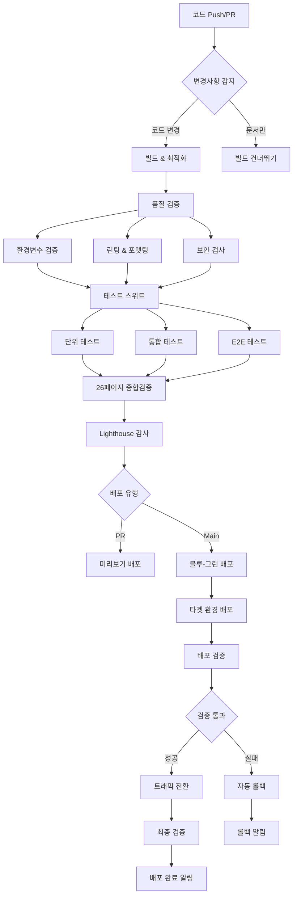

# 🚀 doha.kr CI/CD 파이프라인 대시보드

## 📊 배포 파이프라인 현황

### 🔄 메인 워크플로우 상태
- **배포 파이프라인**: `deploy.yml` - 블루-그린 무중단 배포
- **테스트 스위트**: `test.yml` - 종합 테스트 실행  
- **수동 롤백**: `manual-rollback.yml` - 긴급 롤백 처리
- **모니터링**: `vercel-monitoring.yml` - 실시간 사이트 모니터링

### 🎯 배포 환경
- **Production**: https://doha.kr (GitHub Pages + Vercel API)
- **Blue Environment**: doha-blue.vercel.app  
- **Green Environment**: doha-green.vercel.app
- **Preview**: 각 PR마다 자동 생성

## 🛠️ CI/CD 파이프라인 아키텍처



## 🔍 주요 검증 단계

### 1️⃣ 빌드 및 최적화
- ✅ CSS 번들링 (52개 파일 → 1개)
- ✅ JavaScript 번들링 및 트리 쉐이킹
- ✅ 이미지 최적화 (WebP/AVIF 변환)
- ✅ PWA 매니페스트 및 서비스 워커 빌드
- ✅ 번들 크기 분석 및 경고

### 2️⃣ 품질 검증
- ✅ **ESLint**: JavaScript 코드 품질
- ✅ **Prettier**: 코드 포맷팅 일관성
- ✅ **npm audit**: 보안 취약점 검사
- ✅ **환경변수**: 필수 설정 및 형식 검증
- ✅ **CSP 정책**: 보안 헤더 검증

### 3️⃣ 테스트 실행
- ✅ **단위 테스트**: Vitest (80% 커버리지 목표)
- ✅ **통합 테스트**: API 엔드포인트 검증
- ✅ **E2E 테스트**: Playwright 다중 브라우저
- ✅ **26페이지 검증**: 전체 사이트 기능 테스트
- ✅ **접근성 테스트**: WCAG 2.1 AA 준수

### 4️⃣ 성능 감사
- ✅ **Lighthouse CI**: 성능/접근성/SEO/PWA 점수
- ✅ **Core Web Vitals**: LCP, FID, CLS 측정
- ✅ **번들 크기**: 임계값 모니터링
- ✅ **응답 시간**: API 성능 측정

### 5️⃣ 배포 검증
- ✅ **헬스체크**: API 엔드포인트 정상 작동
- ✅ **기능 테스트**: 주요 기능 실시간 확인
- ✅ **성능 검증**: 응답 시간 임계값 확인
- ✅ **SEO 확인**: 메타태그 및 구조화 데이터
- ✅ **한글 인코딩**: UTF-8 및 폰트 로딩

## 🎯 환경별 배포 전략

### Production 배포 (main 브랜치)
```yaml
트리거: push to main
전략: 블루-그린 무중단 배포
검증: 전체 테스트 스위트 + 26페이지 검증
롤백: 자동 롤백 + 수동 롤백 지원
모니터링: 실시간 헬스체크 (5분 간격)
```

### Staging 배포 (PR)
```yaml
트리거: Pull Request
전략: Vercel 미리보기 배포
검증: 단위/통합 테스트 + Lighthouse
알림: PR 코멘트에 결과 리포팅
정리: PR 닫힐 때 자동 정리
```

### 개발 환경 (로컬)
```yaml
명령어: npm run dev
서버: Python HTTP Server (포트 3000)
API: Vercel Dev Server (포트 3001)
핫 리로드: CSS/JS 와치 모드
```

## 🔐 보안 및 환경변수

### 필수 GitHub Secrets
```bash
# Vercel 배포
VERCEL_TOKEN=<vercel_api_token>
VERCEL_ORG_ID=<organization_id>
PROJECT_ID=<vercel_project_id>

# API 서비스
GEMINI_API_KEY=<google_gemini_api_key>

# DNS 및 CDN
CLOUDFLARE_API_TOKEN=<cloudflare_token>
CLOUDFLARE_ZONE_ID=<zone_id>

# 알림 시스템
SLACK_WEBHOOK_URL=<slack_webhook_url>
DISCORD_WEBHOOK_URL=<discord_webhook_url>
```

### 보안 검증 항목
- ✅ Content Security Policy (CSP) 헤더
- ✅ HTTPS 강제 적용 (HSTS)
- ✅ XSS 보호 헤더
- ✅ 클릭재킹 방지 (X-Frame-Options)
- ✅ MIME 타입 스니핑 방지
- ✅ Referrer Policy 설정

## 📈 모니터링 및 알림

### 실시간 모니터링 (5분 간격)
- 🔍 **사이트 헬스체크**: 메인 페이지 접근성
- 🔌 **API 상태**: 모든 엔드포인트 응답
- ⚡ **성능 모니터링**: 응답 시간 추적
- 🧪 **핵심 기능**: 심리테스트/운세/도구 기능

### 알림 채널
- 📢 **Slack**: #alerts 채널에 즉시 알림
- 💬 **Discord**: 백업 알림 채널
- 🐛 **GitHub Issues**: 자동 이슈 생성 및 관리
- 📧 **GitHub Notifications**: 워크플로우 실패 알림

### 알림 레벨
```yaml
🟢 SUCCESS: 배포 성공 (일반 알림)
🟡 WARNING: 성능 저하/비중요 실패 (경고 알림)
🔴 ERROR: 사이트 다운/배포 실패 (긴급 알림)  
🚨 CRITICAL: 롤백 실패 (즉시 대응 필요)
```

## 🔄 롤백 전략

### 자동 롤백 조건
- 배포 후 검증 실패 (헬스체크, 기능 테스트)
- API 엔드포인트 응답 실패
- 성능 임계값 초과 (응답 시간 > 5초)
- 26페이지 검증 실패

### 수동 롤백 프로세스
1. **긴급 롤백**: `manual-rollback.yml` 워크플로우 실행
2. **환경 선택**: Blue ↔ Green 환경 전환
3. **사유 기록**: 롤백 이유 필수 입력
4. **자동 검증**: 롤백 후 기능 확인
5. **알림 발송**: 팀 전체 롤백 완료 통지

### 복구 프로세스
- 🔍 문제 원인 분석 및 수정
- 🧪 수정사항 테스트 확인
- 🚀 새로운 배포 시도
- ✅ 배포 성공 후 모니터링 강화

## 📊 성능 지표 및 목표

### Lighthouse 목표 점수
- **Performance**: 90점 이상
- **Accessibility**: 95점 이상
- **SEO**: 100점
- **PWA**: 100점

### 응답 시간 목표
- **메인 페이지**: 3초 이하
- **API 엔드포인트**: 2초 이하
- **정적 리소스**: 1초 이하

### 테스트 커버리지 목표
- **단위 테스트**: 80% 이상
- **통합 테스트**: 핵심 API 100%
- **E2E 테스트**: 주요 사용자 플로우 100%

## 🚨 문제 해결 가이드

### 배포 실패 시
1. **GitHub Actions 로그** 확인
2. **Vercel Dashboard** 상태 점검
3. **환경변수** 설정 재확인
4. **API 할당량** 사용량 체크
5. 필요시 **수동 롤백** 실행

### 사이트 다운 시
1. **모니터링 알림** 확인
2. **DNS 상태** 점검 (nslookup doha.kr)
3. **Vercel 상태 페이지** 확인
4. **Cloudflare 대시보드** 점검
5. **수동 롤백** 고려

### API 오류 시
1. **API 로그** 확인 (`/api/logs`)
2. **Gemini API 키** 상태 확인
3. **Rate Limit** 초과 여부 점검
4. **환경변수** 재설정
5. **Vercel 함수** 재배포

## 🎉 배포 성공 체크리스트

- [ ] ✅ 모든 자동 테스트 통과
- [ ] ✅ Lighthouse 점수 목표 달성
- [ ] ✅ 26페이지 검증 통과
- [ ] ✅ API 엔드포인트 정상 작동
- [ ] ✅ 성능 임계값 만족
- [ ] ✅ 보안 헤더 적용
- [ ] ✅ PWA 기능 활성화
- [ ] ✅ 한글 인코딩 정상
- [ ] ✅ 모니터링 알림 정상
- [ ] ✅ 팀 알림 발송 완료

## 📞 긴급 연락처 및 리소스

### 주요 대시보드
- **GitHub Actions**: https://github.com/doha1003/teste/actions
- **Vercel Dashboard**: https://vercel.com/dashboard
- **Cloudflare Dashboard**: https://dash.cloudflare.com
- **사이트 상태**: https://doha.kr/api/health

### 유용한 명령어
```bash
# 로컬 전체 테스트
npm run test:all

# 26페이지 검증
npm run test:26pages

# 배포 준비도 체크
npm run deploy:check

# Lighthouse 감사
npm run lighthouse:pwa

# 환경변수 검증
node scripts/env-validation.js
```

---

**마지막 업데이트**: 2025-08-10  
**CI/CD 파이프라인 버전**: v3.0.0  
**문서 관리자**: DevOps Team