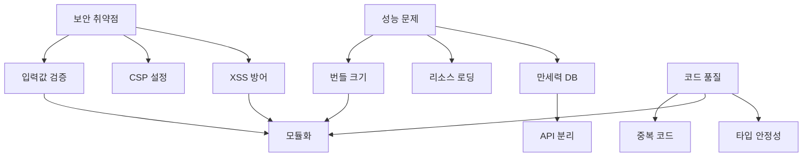

# 🚀 doha.kr 프로젝트 종합 개선 마스터 플랜

## 1. 현황 분석

### 1.1 핵심 문제점 매트릭스

| 문제 영역 | 심각도 | 긴급도 | 영향 범위 | 다른 문제와의 연관성 |
|-----------|--------|--------|------------|---------------------|
| **보안 취약점** | 🔴 높음 | 🔴 높음 | 전체 서비스 | 코드 품질, 성능 |
| **성능 문제** | 🔴 높음 | 🟡 중간 | 사용자 경험 | 파일 구조, 만세력 DB |
| **코드 품질** | 🟡 중간 | 🟡 중간 | 유지보수성 | 모든 영역 |
| **파일 구조** | 🟢 낮음 | 🟢 낮음 | 개발 효율성 | 성능, 유지보수 |
| **만세력 DB** | 🔴 높음 | 🟡 중간 | 핵심 기능 | 성능, 아키텍처 |

### 1.2 문제점 간 의존성 분석



## 2. 종합 개선 전략

### 2.1 핵심 원칙
1. **점진적 개선**: 서비스 중단 없이 단계별 적용
2. **병렬 작업**: 독립적인 작업은 동시 진행
3. **자동화 우선**: 반복 작업은 도구로 자동화
4. **측정 가능**: 모든 개선은 수치로 검증

### 2.2 작업 그룹화

#### Group A: 기반 구축 (선행 필수)
- 개발 환경 설정
- 빌드 도구 구성
- 테스트 환경 구축
- 모니터링 도구 설치

#### Group B: 보안 강화 (독립 실행 가능)
- 입력값 검증 라이브러리
- CSP 정책 수립
- 보안 헤더 설정
- XSS 방어 구현

#### Group C: 성능 최적화 (부분 의존)
- 번들링 최적화
- 이미지 최적화
- 리소스 로딩 개선
- 캐싱 전략

#### Group D: 코드 품질 (전체 의존)
- 린팅 규칙 설정
- 타입스크립트 도입
- 모듈 시스템 구축
- 테스트 코드 작성

## 3. 필요 도구 및 환경

### 3.1 즉시 설치 필요

```bash
# 패키지 관리자 확인
npm --version || curl -o- https://raw.githubusercontent.com/nvm-sh/nvm/v0.39.0/install.sh | bash

# 필수 개발 도구
npm install --save-dev \
  webpack@5 webpack-cli webpack-dev-server \
  @babel/core @babel/preset-env babel-loader \
  css-loader style-loader mini-css-extract-plugin \
  html-webpack-plugin clean-webpack-plugin \
  terser-webpack-plugin css-minimizer-webpack-plugin

# 보안 도구
npm install --save \
  dompurify \
  helmet \
  express-rate-limit \
  joi

# 품질 도구
npm install --save-dev \
  eslint prettier \
  eslint-config-prettier eslint-plugin-prettier \
  @typescript-eslint/parser @typescript-eslint/eslint-plugin \
  typescript

# 테스트 도구
npm install --save-dev \
  jest @types/jest \
  @testing-library/jest-dom \
  playwright

# 성능 도구
npm install --save-dev \
  webpack-bundle-analyzer \
  lighthouse \
  workbox-webpack-plugin
```

### 3.2 설정 파일 생성 필요

1. **webpack.config.js** (개선된 버전)
2. **.eslintrc.js** (코드 품질)
3. **tsconfig.json** (타입스크립트)
4. **jest.config.js** (테스트)
5. **.prettierrc** (코드 포맷팅)

## 4. 만세력 DB 최적화 전략

### 4.1 현재 상황 분석
- 크기: 38MB (1,676,489 라인)
- 데이터: 98,614개 레코드
- 특성: 모든 데이터가 필수 (생략 불가)

### 4.2 해결 방안

#### Option 1: 서버 API 분리 (권장)
```javascript
// 현재: 전체 DB 로드
import manseryeokDB from './manseryeok-database.js';

// 개선: API 호출
async function getManseryeok(year, month, day) {
    const response = await fetch(`/api/manseryeok?date=${year}-${month}-${day}`);
    return response.json();
}
```

#### Option 2: 점진적 로딩
```javascript
// 청크 분할 (년도별)
const loadManseryeokChunk = async (yearRange) => {
    const module = await import(`./manseryeok/chunk-${yearRange}.js`);
    return module.default;
};

// 필요시 로드
const data = await loadManseryeokChunk('2020-2030');
```

#### Option 3: IndexedDB 캐싱
```javascript
// 로컬 DB에 저장
const saveManseryeokToDB = async (data) => {
    const db = await openDB('manseryeok', 1);
    await db.put('data', data);
};

// 필요시 조회
const getManseryeokFromDB = async (date) => {
    const db = await openDB('manseryeok', 1);
    return db.get('data', date);
};
```

## 5. 실행 계획

### Phase 1: 기반 구축 (1주차)

#### Day 1-2: 환경 설정
- [ ] 개발 환경 구성
- [ ] 필수 패키지 설치
- [ ] 설정 파일 생성
- [ ] Git 브랜치 전략 수립

#### Day 3-4: 빌드 시스템
- [ ] Webpack 설정 최적화
- [ ] 개발/프로덕션 환경 분리
- [ ] 번들 분석 도구 설정
- [ ] CI/CD 파이프라인 구축

#### Day 5-7: 테스트 환경
- [ ] Jest 설정
- [ ] Playwright E2E 테스트
- [ ] 성능 측정 자동화
- [ ] 보안 스캔 자동화

### Phase 2: 병렬 작업 (2-3주차)

#### Track A: 보안 (독립 팀 가능)
- [ ] DOMPurify 전체 적용
- [ ] CSP 헤더 구현
- [ ] 입력값 검증 모듈 개발
- [ ] 보안 테스트 자동화

#### Track B: 성능 (독립 팀 가능)
- [ ] 이미지 최적화 스크립트
- [ ] 리소스 힌트 적용
- [ ] 번들 분할 구현
- [ ] Service Worker 개선

#### Track C: 만세력 DB (전담 팀)
- [ ] API 서버 구축
- [ ] 데이터 마이그레이션
- [ ] 캐싱 레이어 구현
- [ ] 성능 테스트

### Phase 3: 통합 및 리팩토링 (4-5주차)

#### 순차 작업 (의존성 있음)
1. [ ] TypeScript 점진적 도입
2. [ ] 중복 코드 제거
3. [ ] 모듈 시스템 구축
4. [ ] 컴포넌트 분리

### Phase 4: 검증 및 배포 (6주차)
- [ ] 전체 기능 테스트
- [ ] 성능 벤치마크
- [ ] 보안 감사
- [ ] 단계별 배포

## 6. 위험 요소 및 대응 방안

### 6.1 기술적 위험
| 위험 요소 | 발생 가능성 | 영향도 | 대응 방안 |
|----------|------------|--------|----------|
| 만세력 API 지연 | 중간 | 높음 | CDN 캐싱, 사전 로딩 |
| 구 브라우저 호환성 | 낮음 | 중간 | Babel 트랜스파일 |
| 빌드 시간 증가 | 높음 | 낮음 | 병렬 빌드, 캐시 활용 |

### 6.2 운영적 위험
| 위험 요소 | 발생 가능성 | 영향도 | 대응 방안 |
|----------|------------|--------|----------|
| 서비스 중단 | 낮음 | 높음 | Blue-Green 배포 |
| 성능 저하 | 중간 | 중간 | 점진적 롤아웃 |
| 사용자 혼란 | 낮음 | 낮음 | A/B 테스트 |

## 7. 성공 지표

### 7.1 정량적 지표
- **보안**: OWASP 점수 85점 이상
- **성능**: Lighthouse 90점 이상
- **번들 크기**: 초기 로드 < 200KB
- **로딩 시간**: FCP < 1.5초, TTI < 3초

### 7.2 정성적 지표
- 개발자 만족도 향상
- 코드 리뷰 시간 단축
- 버그 발생률 감소
- 새 기능 개발 속도 향상

## 8. 도구 개발 필요 사항

### 8.1 커스텀 도구 개발

#### 1. 만세력 데이터 변환기
```javascript
// tools/manseryeok-converter.js
const convertManseryeokToDB = async () => {
    // 대용량 JS를 SQLite/PostgreSQL로 변환
    // 년도별 청크 분할
    // API 엔드포인트 생성
};
```

#### 2. 보안 검사 자동화
```javascript
// tools/security-scanner.js
const scanSecurityIssues = async () => {
    // XSS 패턴 검사
    // 입력값 검증 확인
    // CSP 정책 검증
};
```

#### 3. 성능 모니터링
```javascript
// tools/performance-monitor.js
const monitorPerformance = async () => {
    // 실시간 메트릭 수집
    // 임계값 알림
    // 리포트 생성
};
```

## 9. 결론

이 마스터 플랜은 doha.kr 프로젝트의 모든 문제를 체계적으로 해결하기 위한 로드맵입니다. 핵심은:

1. **병렬 작업 최대화**: 보안, 성능, DB 최적화는 독립적으로 진행
2. **점진적 개선**: 서비스 중단 없이 단계별 적용
3. **자동화 우선**: 모든 반복 작업은 도구로 해결
4. **측정 가능한 목표**: 명확한 성공 지표 설정

만세력 DB의 경우, 데이터 무결성을 유지하면서도 성능을 개선할 수 있는 API 기반 솔루션을 권장합니다.