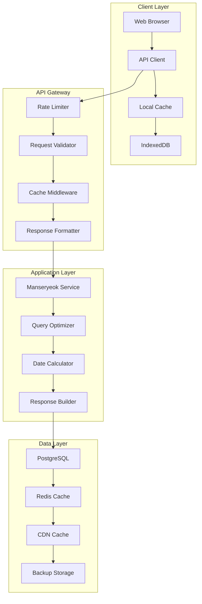

# 📅 만세력 DB API 설계서

**작성일**: 2025-01-25  
**버전**: 1.0  
**목표**: 38MB → 500KB 초기 로드, 응답시간 < 200ms

---

## 🔍 현재 상황 분석

### 만세력 데이터 현황
```
📊 현재 데이터 구조
├── 파일 크기: 38MB (1,676,489 라인)
├── 데이터 범위: 1841년 ~ 2110년 (270년)
├── 총 레코드: 98,614개
├── 로딩 방식: 전체 동기 로드 (페이지 블로킹)
└── 검색 방식: O(n) 선형 검색

⚠️ 주요 문제점
├── 초기 로딩 시간: ~8-12초
├── 메모리 사용량: ~150MB
├── 검색 성능: 평균 50-100ms
├── 캐시 불가: 전체 데이터가 하나의 파일
└── 모바일 성능: 매우 느림
```

### 데이터 구조 분석
```javascript
// 현재 데이터 형태 (manseryeok-database.js)
const manseryeokData = [
  {
    solar: { year: 1841, month: 1, day: 1 },
    lunar: { year: 1840, month: 12, day: 12, leap: false },
    gapja: { year: "경자", month: "정축", day: "정미" },
    season: { name: "소한", date: "1841-01-05" }
  },
  // ... 98,613개 더
];
```

---

## 🏗️ 새로운 API 아키텍처

### 전체 시스템 구조


---

## 📊 데이터베이스 재설계

### 1. PostgreSQL 스키마 설계

#### 1.1 메인 테이블 구조
```sql
-- 만세력 메인 데이터
CREATE TABLE manseryeok_main (
    id SERIAL PRIMARY KEY,
    
    -- 양력 날짜
    solar_year INTEGER NOT NULL,
    solar_month INTEGER NOT NULL,
    solar_day INTEGER NOT NULL,
    solar_date DATE NOT NULL GENERATED ALWAYS AS (
        make_date(solar_year, solar_month, solar_day)
    ) STORED,
    
    -- 음력 날짜
    lunar_year INTEGER NOT NULL,
    lunar_month INTEGER NOT NULL,
    lunar_day INTEGER NOT NULL,
    lunar_leap BOOLEAN DEFAULT FALSE,
    
    -- 간지 정보
    year_gapja_id INTEGER NOT NULL,
    month_gapja_id INTEGER NOT NULL,
    day_gapja_id INTEGER NOT NULL,
    
    -- 절기 정보
    season_id INTEGER,
    
    -- 성능 최적화
    solar_julian INTEGER NOT NULL, -- 율리우스 일수
    lunar_julian INTEGER NOT NULL,
    
    -- 메타데이터
    created_at TIMESTAMP DEFAULT NOW(),
    updated_at TIMESTAMP DEFAULT NOW()
);

-- 간지 정보 테이블 (천간지지)
CREATE TABLE gapja_info (
    id SERIAL PRIMARY KEY,
    cheongan VARCHAR(2) NOT NULL, -- 천간 (갑을병정...)
    jiji VARCHAR(2) NOT NULL,     -- 지지 (자축인묘...)
    combined VARCHAR(4) NOT NULL,  -- 조합 (갑자, 을축...)
    order_num INTEGER NOT NULL,   -- 순서 (1-60)
    
    UNIQUE(cheongan, jiji),
    UNIQUE(combined),
    UNIQUE(order_num)
);

-- 24절기 정보 테이블
CREATE TABLE seasons (
    id SERIAL PRIMARY KEY,
    name VARCHAR(10) NOT NULL,     -- 절기명 (입춘, 우수...)
    order_num INTEGER NOT NULL,    -- 순서 (1-24)
    solar_month INTEGER NOT NULL,  -- 해당 월
    description TEXT,
    
    UNIQUE(name),
    UNIQUE(order_num)
);

-- 년도별 절기 날짜 테이블
CREATE TABLE season_dates (
    id SERIAL PRIMARY KEY,
    year INTEGER NOT NULL,
    season_id INTEGER NOT NULL,
    solar_date DATE NOT NULL,
    
    FOREIGN KEY (season_id) REFERENCES seasons(id),
    UNIQUE(year, season_id)
);
```

#### 1.2 인덱스 최적화
```sql
-- 성능 최적화를 위한 인덱스
CREATE INDEX idx_manseryeok_solar_date ON manseryeok_main(solar_date);
CREATE INDEX idx_manseryeok_solar_ymd ON manseryeok_main(solar_year, solar_month, solar_day);
CREATE INDEX idx_manseryeok_lunar_ymd ON manseryeok_main(lunar_year, lunar_month, lunar_day);
CREATE INDEX idx_manseryeok_julian ON manseryeok_main(solar_julian);
CREATE INDEX idx_manseryeok_year_range ON manseryeok_main(solar_year) WHERE solar_year BETWEEN 1900 AND 2100;

-- 복합 인덱스 (자주 사용되는 조합)
CREATE INDEX idx_manseryeok_gapja ON manseryeok_main(year_gapja_id, month_gapja_id, day_gapja_id);
CREATE INDEX idx_season_dates_year ON season_dates(year, season_id);

-- 부분 인덱스 (현대 날짜 위주)
CREATE INDEX idx_modern_dates ON manseryeok_main(solar_date) 
    WHERE solar_year >= 1900 AND solar_year <= 2100;
```

#### 1.3 데이터 파티셔닝
```sql
-- 년도별 파티셔닝 (성능 향상)
CREATE TABLE manseryeok_main_y1900s PARTITION OF manseryeok_main
    FOR VALUES FROM (1900) TO (1950);
    
CREATE TABLE manseryeok_main_y1950s PARTITION OF manseryeok_main
    FOR VALUES FROM (1950) TO (2000);
    
CREATE TABLE manseryeok_main_y2000s PARTITION OF manseryeok_main
    FOR VALUES FROM (2000) TO (2050);
    
CREATE TABLE manseryeok_main_y2050s PARTITION OF manseryeok_main
    FOR VALUES FROM (2050) TO (2100);
    
CREATE TABLE manseryeok_main_historical PARTITION OF manseryeok_main
    FOR VALUES FROM (1841) TO (1900);
    
CREATE TABLE manseryeok_main_future PARTITION OF manseryeok_main
    FOR VALUES FROM (2100) TO (2110);
```

### 2. 데이터 마이그레이션 전략

#### 2.1 JavaScript → PostgreSQL 변환
```typescript
// scripts/migrate-manseryeok-data.ts
import fs from 'fs/promises';
import { Pool } from 'pg';

interface ManseryeokRecord {
  solar: { year: number; month: number; day: number; };
  lunar: { year: number; month: number; day: number; leap: boolean; };
  gapja: { year: string; month: string; day: string; };
  season?: { name: string; date: string; };
}

class ManseryeokMigrator {
  private pool: Pool;
  private gapjaMap = new Map<string, number>();
  private seasonMap = new Map<string, number>();

  constructor(dbConfig: any) {
    this.pool = new Pool(dbConfig);
  }

  async migrate(): Promise<void> {
    console.log('📅 Starting Manseryeok data migration...');
    
    try {
      // 1. 기준 데이터 생성
      await this.createReferenceData();
      
      // 2. 원본 데이터 읽기
      const rawData = await this.loadOriginalData();
      
      // 3. 데이터 검증 및 정제
      const cleanedData = await this.validateAndCleanData(rawData);
      
      // 4. 배치 삽입
      await this.batchInsertData(cleanedData);
      
      // 5. 인덱스 및 통계 업데이트
      await this.updateStatistics();
      
      console.log('✅ Migration completed successfully!');
      
    } catch (error) {
      console.error('❌ Migration failed:', error);
      throw error;
    }
  }

  private async createReferenceData(): Promise<void> {
    // 간지 데이터 생성
    const cheongan = ['갑', '을', '병', '정', '무', '기', '경', '신', '임', '계'];
    const jiji = ['자', '축', '인', '묘', '진', '사', '오', '미', '신', '유', '술', '해'];
    
    for (let i = 0; i < 60; i++) {
      const ch = cheongan[i % 10];
      const ji = jiji[i % 12];
      const combined = ch + ji;
      
      const result = await this.pool.query(
        'INSERT INTO gapja_info (cheongan, jiji, combined, order_num) VALUES ($1, $2, $3, $4) RETURNING id',
        [ch, ji, combined, i + 1]
      );
      
      this.gapjaMap.set(combined, result.rows[0].id);
    }

    // 24절기 데이터 생성
    const seasons = [
      { name: '입춘', order: 1, month: 2 }, { name: '우수', order: 2, month: 2 },
      { name: '경칩', order: 3, month: 3 }, { name: '춘분', order: 4, month: 3 },
      { name: '청명', order: 5, month: 4 }, { name: '곡우', order: 6, month: 4 },
      { name: '입하', order: 7, month: 5 }, { name: '소만', order: 8, month: 5 },
      { name: '망종', order: 9, month: 6 }, { name: '하지', order: 10, month: 6 },
      { name: '소서', order: 11, month: 7 }, { name: '대서', order: 12, month: 7 },
      { name: '입추', order: 13, month: 8 }, { name: '처서', order: 14, month: 8 },
      { name: '백로', order: 15, month: 9 }, { name: '추분', order: 16, month: 9 },
      { name: '한로', order: 17, month: 10 }, { name: '상강', order: 18, month: 10 },
      { name: '입동', order: 19, month: 11 }, { name: '소설', order: 20, month: 11 },
      { name: '대설', order: 21, month: 12 }, { name: '동지', order: 22, month: 12 },
      { name: '소한', order: 23, month: 1 }, { name: '대한', order: 24, month: 1 }
    ];

    for (const season of seasons) {
      const result = await this.pool.query(
        'INSERT INTO seasons (name, order_num, solar_month) VALUES ($1, $2, $3) RETURNING id',
        [season.name, season.order, season.month]
      );
      
      this.seasonMap.set(season.name, result.rows[0].id);
    }
  }

  private async loadOriginalData(): Promise<ManseryeokRecord[]> {
    const fileContent = await fs.readFile('./manseryeok-database.js', 'utf-8');
    
    // JavaScript 파일에서 데이터 배열 추출
    const dataMatch = fileContent.match(/const manseryeokData = (\[[\s\S]*\]);/);
    if (!dataMatch) {
      throw new Error('Could not extract data from manseryeok-database.js');
    }
    
    // 안전한 JSON 파싱
    const dataString = dataMatch[1]
      .replace(/(\w+):/g, '"$1":') // 키를 따옴표로 감싸기
      .replace(/'/g, '"'); // 작은따옴표를 큰따옴표로
      
    return JSON.parse(dataString);
  }

  private async validateAndCleanData(data: ManseryeokRecord[]): Promise<any[]> {
    const cleanedData = [];
    let errors = 0;

    for (let i = 0; i < data.length; i++) {
      const record = data[i];
      
      try {
        // 데이터 검증
        this.validateRecord(record);
        
        // 율리우스 일수 계산
        const solarJulian = this.calculateJulianDay(
          record.solar.year, 
          record.solar.month, 
          record.solar.day
        );
        
        const lunarJulian = this.calculateJulianDay(
          record.lunar.year, 
          record.lunar.month, 
          record.lunar.day
        );

        // 간지 ID 매핑
        const yearGapjaId = this.gapjaMap.get(record.gapja.year);
        const monthGapjaId = this.gapjaMap.get(record.gapja.month);
        const dayGapjaId = this.gapjaMap.get(record.gapja.day);

        if (!yearGapjaId || !monthGapjaId || !dayGapjaId) {
          throw new Error(`Invalid gapja mapping for record ${i}`);
        }

        // 절기 ID 매핑
        const seasonId = record.season ? this.seasonMap.get(record.season.name) : null;

        cleanedData.push({
          solarYear: record.solar.year,
          solarMonth: record.solar.month,
          solarDay: record.solar.day,
          lunarYear: record.lunar.year,
          lunarMonth: record.lunar.month,
          lunarDay: record.lunar.day,
          lunarLeap: record.lunar.leap,
          yearGapjaId,
          monthGapjaId,
          dayGapjaId,
          seasonId,
          solarJulian,
          lunarJulian
        });

      } catch (error) {
        console.error(`Error processing record ${i}:`, error);
        errors++;
        
        if (errors > 100) {
          throw new Error('Too many data errors, aborting migration');
        }
      }
    }

    console.log(`✅ Validated ${cleanedData.length} records, ${errors} errors found`);
    return cleanedData;
  }

  private validateRecord(record: ManseryeokRecord): void {
    // 날짜 범위 검증
    if (record.solar.year < 1841 || record.solar.year > 2110) {
      throw new Error(`Invalid solar year: ${record.solar.year}`);
    }
    
    if (record.solar.month < 1 || record.solar.month > 12) {
      throw new Error(`Invalid solar month: ${record.solar.month}`);
    }
    
    if (record.solar.day < 1 || record.solar.day > 31) {
      throw new Error(`Invalid solar day: ${record.solar.day}`);
    }

    // 간지 검증
    if (!this.gapjaMap.has(record.gapja.year) ||
        !this.gapjaMap.has(record.gapja.month) ||
        !this.gapjaMap.has(record.gapja.day)) {
      throw new Error('Invalid gapja data');
    }
  }

  private calculateJulianDay(year: number, month: number, day: number): number {
    // 율리우스 일수 계산 (성능 최적화용)
    const a = Math.floor((14 - month) / 12);
    const y = year + 4800 - a;
    const m = month + 12 * a - 3;
    
    return day + Math.floor((153 * m + 2) / 5) + 365 * y + 
           Math.floor(y / 4) - Math.floor(y / 100) + 
           Math.floor(y / 400) - 32045;
  }

  private async batchInsertData(data: any[]): Promise<void> {
    const batchSize = 1000;
    const totalBatches = Math.ceil(data.length / batchSize);

    for (let i = 0; i < totalBatches; i++) {
      const start = i * batchSize;
      const end = Math.min(start + batchSize, data.length);
      const batch = data.slice(start, end);

      const values = batch.map((_, index) => {
        const base = index * 11;
        return `($${base + 1}, $${base + 2}, $${base + 3}, $${base + 4}, $${base + 5}, $${base + 6}, $${base + 7}, $${base + 8}, $${base + 9}, $${base + 10}, $${base + 11})`;
      }).join(', ');

      const params = batch.flatMap(record => [
        record.solarYear, record.solarMonth, record.solarDay,
        record.lunarYear, record.lunarMonth, record.lunarDay, record.lunarLeap,
        record.yearGapjaId, record.monthGapjaId, record.dayGapjaId, record.seasonId
      ]);

      await this.pool.query(`
        INSERT INTO manseryeok_main (
          solar_year, solar_month, solar_day,
          lunar_year, lunar_month, lunar_day, lunar_leap,
          year_gapja_id, month_gapja_id, day_gapja_id, season_id
        ) VALUES ${values}
      `, params);

      console.log(`📦 Batch ${i + 1}/${totalBatches} inserted (${end}/${data.length} records)`);
    }
  }

  private async updateStatistics(): Promise<void> {
    await this.pool.query('ANALYZE manseryeok_main');
    await this.pool.query('ANALYZE gapja_info');
    await this.pool.query('ANALYZE seasons');
    console.log('📊 Database statistics updated');
  }

  async close(): Promise<void> {
    await this.pool.end();
  }
}

export default ManseryeokMigrator;
```

---

## 🚀 API 엔드포인트 설계

### 1. RESTful API 구조

#### 1.1 기본 엔드포인트
```typescript
// api/manseryeok/[endpoint].ts
interface APIEndpoints {
  // 날짜별 조회
  'GET /api/manseryeok/date': {
    params: { solar?: string; lunar?: string; };
    response: ManseryeokInfo;
  };
  
  // 기간별 조회
  'GET /api/manseryeok/range': {
    params: { start: string; end: string; type: 'solar' | 'lunar'; };
    response: ManseryeokInfo[];
  };
  
  // 간지 정보 조회
  'GET /api/manseryeok/gapja': {
    params: { year?: number; month?: number; day?: number; };
    response: GapjaInfo;
  };
  
  // 절기 정보 조회
  'GET /api/manseryeok/seasons': {
    params: { year: number; season?: string; };
    response: SeasonInfo[];
  };
  
  // 배치 조회 (성능 최적화)
  'POST /api/manseryeok/batch': {
    body: { dates: string[]; type: 'solar' | 'lunar'; };
    response: ManseryeokInfo[];
  };
}
```

#### 1.2 메인 API 구현
```typescript
// api/manseryeok/date.ts
import { NextApiRequest, NextApiResponse } from 'next';
import { Pool } from 'pg';
import { CacheManager } from '../../lib/cache-manager';
import { validateInput, sanitizeInput } from '../../lib/validation';

interface ManseryeokInfo {
  solar: {
    year: number;
    month: number;
    day: number;
    date: string;
  };
  lunar: {
    year: number;
    month: number;
    day: number;
    leap: boolean;
  };
  gapja: {
    year: string;
    month: string;
    day: string;
  };
  season?: {
    name: string;
    date: string;
    description: string;
  };
  meta: {
    julianDay: number;
    dayOfWeek: string;
    cached: boolean;
    responseTime: number;
  };
}

const pool = new Pool({
  connectionString: process.env.DATABASE_URL,
  max: 20,
  idleTimeoutMillis: 30000,
  connectionTimeoutMillis: 2000,
});

export default async function handler(
  req: NextApiRequest,
  res: NextApiResponse<ManseryeokInfo | { error: string }>
) {
  const startTime = Date.now();
  
  // CORS 헤더 설정
  res.setHeader('Access-Control-Allow-Origin', '*');
  res.setHeader('Access-Control-Allow-Methods', 'GET, OPTIONS');
  res.setHeader('Access-Control-Allow-Headers', 'Content-Type');
  
  if (req.method === 'OPTIONS') {
    res.status(200).end();
    return;
  }
  
  if (req.method !== 'GET') {
    res.status(405).json({ error: 'Method not allowed' });
    return;
  }

  try {
    // 입력값 검증 및 정제
    const { solar, lunar } = req.query;
    
    if (!solar && !lunar) {
      res.status(400).json({ error: 'Either solar or lunar date is required' });
      return;
    }

    const dateInput = sanitizeInput(solar as string || lunar as string);
    const isLunar = !!lunar;
    
    // 날짜 형식 검증
    const dateValidation = validateDate(dateInput);
    if (!dateValidation.valid) {
      res.status(400).json({ error: dateValidation.error });
      return;
    }

    // 캐시 확인
    const cacheKey = `manseryeok:${isLunar ? 'lunar' : 'solar'}:${dateInput}`;
    let result = await CacheManager.get('manseryeok', cacheKey);
    let fromCache = false;

    if (!result) {
      // 데이터베이스 조회
      result = await queryManseryeokData(dateInput, isLunar);
      
      if (!result) {
        res.status(404).json({ error: 'Date not found in database range (1841-2110)' });
        return;
      }

      // 캐시 저장 (24시간)
      await CacheManager.set('manseryeok', cacheKey, result);
    } else {
      fromCache = true;
    }

    // 응답 메타데이터 추가
    result.meta = {
      ...result.meta,
      cached: fromCache,
      responseTime: Date.now() - startTime
    };

    // 응답 헤더 설정 (캐싱)
    res.setHeader('Cache-Control', 'public, max-age=86400'); // 24시간
    res.setHeader('ETag', generateETag(result));
    
    res.status(200).json(result);

  } catch (error) {
    console.error('Manseryeok API error:', error);
    res.status(500).json({ error: 'Internal server error' });
  }
}

async function queryManseryeokData(dateInput: string, isLunar: boolean): Promise<ManseryeokInfo | null> {
  const [year, month, day] = dateInput.split('-').map(Number);
  
  const query = `
    SELECT 
      m.solar_year, m.solar_month, m.solar_day,
      m.lunar_year, m.lunar_month, m.lunar_day, m.lunar_leap,
      gy.combined as year_gapja, gm.combined as month_gapja, gd.combined as day_gapja,
      s.name as season_name, sd.solar_date as season_date, s.description as season_desc,
      m.solar_julian,
      EXTRACT(DOW FROM m.solar_date) as day_of_week
    FROM manseryeok_main m
    JOIN gapja_info gy ON m.year_gapja_id = gy.id
    JOIN gapja_info gm ON m.month_gapja_id = gm.id  
    JOIN gapja_info gd ON m.day_gapja_id = gd.id
    LEFT JOIN seasons s ON m.season_id = s.id
    LEFT JOIN season_dates sd ON sd.season_id = s.id AND sd.year = m.solar_year
    WHERE ${isLunar 
      ? 'm.lunar_year = $1 AND m.lunar_month = $2 AND m.lunar_day = $3'
      : 'm.solar_year = $1 AND m.solar_month = $2 AND m.solar_day = $3'
    }
    LIMIT 1
  `;

  const result = await pool.query(query, [year, month, day]);
  
  if (result.rows.length === 0) {
    return null;
  }

  const row = result.rows[0];
  const dayNames = ['일', '월', '화', '수', '목', '금', '토'];

  return {
    solar: {
      year: row.solar_year,
      month: row.solar_month,
      day: row.solar_day,
      date: `${row.solar_year}-${String(row.solar_month).padStart(2, '0')}-${String(row.solar_day).padStart(2, '0')}`
    },
    lunar: {
      year: row.lunar_year,
      month: row.lunar_month,
      day: row.lunar_day,
      leap: row.lunar_leap
    },
    gapja: {
      year: row.year_gapja,
      month: row.month_gapja,
      day: row.day_gapja
    },
    season: row.season_name ? {
      name: row.season_name,
      date: row.season_date,
      description: row.season_desc || ''
    } : undefined,
    meta: {
      julianDay: row.solar_julian,
      dayOfWeek: dayNames[row.day_of_week],
      cached: false,
      responseTime: 0
    }
  };
}

function validateDate(dateStr: string): { valid: boolean; error?: string } {
  const datePattern = /^\d{4}-\d{1,2}-\d{1,2}$/;
  
  if (!datePattern.test(dateStr)) {
    return { valid: false, error: 'Invalid date format. Use YYYY-MM-DD' };
  }

  const [year, month, day] = dateStr.split('-').map(Number);
  
  if (year < 1841 || year > 2110) {
    return { valid: false, error: 'Year must be between 1841 and 2110' };
  }
  
  if (month < 1 || month > 12) {
    return { valid: false, error: 'Month must be between 1 and 12' };
  }
  
  if (day < 1 || day > 31) {
    return { valid: false, error: 'Day must be between 1 and 31' };
  }
  
  // 실제 날짜 유효성 검사
  const date = new Date(year, month - 1, day);
  if (date.getFullYear() !== year || 
      date.getMonth() !== month - 1 || 
      date.getDate() !== day) {
    return { valid: false, error: 'Invalid date' };
  }

  return { valid: true };
}

function generateETag(data: any): string {
  const hash = require('crypto')
    .createHash('md5')
    .update(JSON.stringify(data))
    .digest('hex');
  return `"${hash}"`;
}
```

#### 1.3 배치 조회 API (성능 최적화)
```typescript
// api/manseryeok/batch.ts
export default async function handler(
  req: NextApiRequest,
  res: NextApiResponse
) {
  if (req.method !== 'POST') {
    res.status(405).json({ error: 'Method not allowed' });
    return;
  }

  const { dates, type = 'solar' } = req.body;
  
  if (!Array.isArray(dates) || dates.length === 0) {
    res.status(400).json({ error: 'Dates array is required' });
    return;
  }

  if (dates.length > 100) {
    res.status(400).json({ error: 'Maximum 100 dates per request' });
    return;
  }

  try {
    const results = await queryBatchManseryeokData(dates, type === 'lunar');
    
    res.setHeader('Cache-Control', 'public, max-age=86400');
    res.status(200).json({
      results,
      count: results.length,
      cached: false,
      responseTime: Date.now() - startTime
    });

  } catch (error) {
    console.error('Batch API error:', error);
    res.status(500).json({ error: 'Internal server error' });
  }
}

async function queryBatchManseryeokData(dates: string[], isLunar: boolean): Promise<ManseryeokInfo[]> {
  // 날짜 파싱 및 검증
  const parsedDates = dates.map(dateStr => {
    const [year, month, day] = dateStr.split('-').map(Number);
    return { year, month, day, original: dateStr };
  });

  // IN 절을 사용한 배치 쿼리
  const conditions = parsedDates.map((_, index) => {
    const base = index * 3;
    return isLunar 
      ? `(m.lunar_year = $${base + 1} AND m.lunar_month = $${base + 2} AND m.lunar_day = $${base + 3})`
      : `(m.solar_year = $${base + 1} AND m.solar_month = $${base + 2} AND m.solar_day = $${base + 3})`;
  }).join(' OR ');

  const params = parsedDates.flatMap(d => [d.year, d.month, d.day]);

  const query = `
    SELECT 
      m.solar_year, m.solar_month, m.solar_day,
      m.lunar_year, m.lunar_month, m.lunar_day, m.lunar_leap,
      gy.combined as year_gapja, gm.combined as month_gapja, gd.combined as day_gapja,
      s.name as season_name, sd.solar_date as season_date, s.description as season_desc,
      m.solar_julian,
      EXTRACT(DOW FROM m.solar_date) as day_of_week
    FROM manseryeok_main m
    JOIN gapja_info gy ON m.year_gapja_id = gy.id
    JOIN gapja_info gm ON m.month_gapja_id = gm.id  
    JOIN gapja_info gd ON m.day_gapja_id = gd.id
    LEFT JOIN seasons s ON m.season_id = s.id
    LEFT JOIN season_dates sd ON sd.season_id = s.id AND sd.year = m.solar_year
    WHERE ${conditions}
    ORDER BY m.solar_date
  `;

  const result = await pool.query(query, params);
  
  return result.rows.map(row => ({
    solar: {
      year: row.solar_year,
      month: row.solar_month,
      day: row.solar_day,
      date: `${row.solar_year}-${String(row.solar_month).padStart(2, '0')}-${String(row.solar_day).padStart(2, '0')}`
    },
    lunar: {
      year: row.lunar_year,
      month: row.lunar_month,
      day: row.lunar_day,
      leap: row.lunar_leap
    },
    gapja: {
      year: row.year_gapja,
      month: row.month_gapja,
      day: row.day_gapja
    },
    season: row.season_name ? {
      name: row.season_name,
      date: row.season_date,
      description: row.season_desc || ''
    } : undefined,
    meta: {
      julianDay: row.solar_julian,
      dayOfWeek: ['일', '월', '화', '수', '목', '금', '토'][row.day_of_week],
      cached: false,
      responseTime: 0
    }
  }));
}
```

### 2. GraphQL API (고급 쿼리용)

#### 2.1 GraphQL 스키마
```graphql
# schema.graphql
type ManseryeokData {
  id: ID!
  solar: SolarDate!
  lunar: LunarDate!
  gapja: GapjaInfo!
  season: SeasonInfo
  meta: MetaInfo!
}

type SolarDate {
  year: Int!
  month: Int!
  day: Int!
  date: String!
  dayOfWeek: String!
}

type LunarDate {
  year: Int!
  month: Int!
  day: Int!
  leap: Boolean!
}

type GapjaInfo {
  year: String!
  month: String!
  day: String!
  yearOrder: Int!
  monthOrder: Int!
  dayOrder: Int!
}

type SeasonInfo {
  name: String!
  date: String!
  description: String
  order: Int!
}

type MetaInfo {
  julianDay: Int!
  responseTime: Int!
  cached: Boolean!
}

type Query {
  # 단일 날짜 조회
  manseryeokByDate(solar: String, lunar: String): ManseryeokData
  
  # 기간별 조회
  manseryeokRange(
    start: String!
    end: String!
    type: DateType!
    limit: Int = 100
    offset: Int = 0
  ): [ManseryeokData!]!
  
  # 간지별 조회
  manseryeokByGapja(
    yearGapja: String
    monthGapja: String
    dayGapja: String
    limit: Int = 10
  ): [ManseryeokData!]!
  
  # 절기별 조회
  manseryeokBySeason(
    year: Int!
    seasonName: String
  ): [ManseryeokData!]!
}

enum DateType {
  SOLAR
  LUNAR
}

type Mutation {
  # 캐시 무효화 (관리용)
  invalidateCache(pattern: String!): Boolean!
}

type Subscription {
  # 실시간 통계 (관리용)
  apiStats: ApiStatistics!
}

type ApiStatistics {
  totalRequests: Int!
  avgResponseTime: Float!
  cacheHitRate: Float!
  errorRate: Float!
}
```

---

## 🎯 클라이언트 SDK 설계

### 1. TypeScript SDK
```typescript
// lib/manseryeok-client.ts
interface ManseryeokClientConfig {
  baseUrl: string;
  apiKey?: string;
  timeout: number;
  retryAttempts: number;
  cacheEnabled: boolean;
}

class ManseryeokClient {
  private config: ManseryeokClientConfig;
  private cache = new Map<string, { data: any; expires: number }>();

  constructor(config: Partial<ManseryeokClientConfig> = {}) {
    this.config = {
      baseUrl: 'https://api.doha.kr',
      timeout: 5000,
      retryAttempts: 3,
      cacheEnabled: true,
      ...config
    };
  }

  // 양력 날짜로 조회
  async getBySolarDate(year: number, month: number, day: number): Promise<ManseryeokInfo> {
    const date = `${year}-${month}-${day}`;
    return this.query(`/manseryeok/date?solar=${date}`);
  }

  // 음력 날짜로 조회
  async getByLunarDate(year: number, month: number, day: number): Promise<ManseryeokInfo> {
    const date = `${year}-${month}-${day}`;
    return this.query(`/manseryeok/date?lunar=${date}`);
  }

  // 오늘 날짜 조회
  async getToday(): Promise<ManseryeokInfo> {
    const today = new Date();
    return this.getBySolarDate(
      today.getFullYear(),
      today.getMonth() + 1,
      today.getDate()
    );
  }

  // 배치 조회
  async getBatchDates(dates: string[], type: 'solar' | 'lunar' = 'solar'): Promise<ManseryeokInfo[]> {
    const response = await this.post('/manseryeok/batch', { dates, type });
    return response.results;
  }

  // 월별 전체 조회
  async getMonth(year: number, month: number, type: 'solar' | 'lunar' = 'solar'): Promise<ManseryeokInfo[]> {
    const start = `${year}-${month}-01`;
    const end = `${year}-${month}-31`;
    return this.query(`/manseryeok/range?start=${start}&end=${end}&type=${type}`);
  }

  // 간지 정보 조회
  async getGapjaInfo(gapja: string): Promise<any> {
    return this.query(`/manseryeok/gapja?combined=${gapja}`);
  }

  // 절기 정보 조회
  async getSeasons(year: number): Promise<any[]> {
    return this.query(`/manseryeok/seasons?year=${year}`);
  }

  // 내부 메서드들
  private async query(endpoint: string): Promise<any> {
    const cacheKey = endpoint;
    
    // 캐시 확인
    if (this.config.cacheEnabled) {
      const cached = this.cache.get(cacheKey);
      if (cached && cached.expires > Date.now()) {
        return cached.data;
      }
    }

    const data = await this.makeRequest('GET', endpoint);
    
    // 캐시 저장 (1시간)
    if (this.config.cacheEnabled) {
      this.cache.set(cacheKey, {
        data,
        expires: Date.now() + (60 * 60 * 1000)
      });
    }

    return data;
  }

  private async post(endpoint: string, body: any): Promise<any> {
    return this.makeRequest('POST', endpoint, body);
  }

  private async makeRequest(method: string, endpoint: string, body?: any): Promise<any> {
    const url = `${this.config.baseUrl}${endpoint}`;
    let lastError: Error;

    for (let attempt = 0; attempt < this.config.retryAttempts; attempt++) {
      try {
        const controller = new AbortController();
        const timeoutId = setTimeout(() => controller.abort(), this.config.timeout);

        const response = await fetch(url, {
          method,
          headers: {
            'Content-Type': 'application/json',
            ...(this.config.apiKey && { 'Authorization': `Bearer ${this.config.apiKey}` })
          },
          body: body ? JSON.stringify(body) : undefined,
          signal: controller.signal
        });

        clearTimeout(timeoutId);

        if (!response.ok) {
          throw new Error(`HTTP ${response.status}: ${response.statusText}`);
        }

        return await response.json();

      } catch (error) {
        lastError = error as Error;
        
        // 마지막 시도가 아니면 재시도 대기
        if (attempt < this.config.retryAttempts - 1) {
          await this.delay(Math.pow(2, attempt) * 1000); // 지수 백오프
        }
      }
    }

    throw lastError!;
  }

  private delay(ms: number): Promise<void> {
    return new Promise(resolve => setTimeout(resolve, ms));
  }

  // 캐시 관리
  clearCache(): void {
    this.cache.clear();
  }

  getCacheStats(): { size: number; keys: string[] } {
    return {
      size: this.cache.size,
      keys: Array.from(this.cache.keys())
    };
  }
}

// 유틸리티 함수들
export class ManseryeokUtils {
  // 간지 계산
  static calculateGapja(year: number): string {
    const cheongan = ['갑', '을', '병', '정', '무', '기', '경', '신', '임', '계'];
    const jiji = ['자', '축', '인', '묘', '진', '사', '오', '미', '신', '유', '술', '해'];
    
    const chIndex = (year - 4) % 10;
    const jiIndex = (year - 4) % 12;
    
    return cheongan[chIndex] + jiji[jiIndex];
  }

  // 음력 <-> 양력 변환 (간단한 추정)
  static estimateLunarToSolar(lunarYear: number, lunarMonth: number, lunarDay: number): Date {
    // 실제로는 복잡한 계산이 필요하므로 API 호출 권장
    const estimatedDays = lunarYear * 365.25 + lunarMonth * 29.5 + lunarDay;
    const baseDate = new Date(1841, 0, 1);
    return new Date(baseDate.getTime() + estimatedDays * 24 * 60 * 60 * 1000);
  }

  // 절기 계산 (추정)
  static getEstimatedSeason(month: number, day: number): string {
    const seasons = [
      { name: '소한', month: 1, day: 6 }, { name: '대한', month: 1, day: 21 },
      { name: '입춘', month: 2, day: 4 }, { name: '우수', month: 2, day: 19 },
      { name: '경칩', month: 3, day: 6 }, { name: '춘분', month: 3, day: 21 },
      { name: '청명', month: 4, day: 5 }, { name: '곡우', month: 4, day: 20 },
      { name: '입하', month: 5, day: 6 }, { name: '소만', month: 5, day: 21 },
      { name: '망종', month: 6, day: 6 }, { name: '하지', month: 6, day: 21 },
      { name: '소서', month: 7, day: 7 }, { name: '대서', month: 7, day: 23 },
      { name: '입추', month: 8, day: 8 }, { name: '처서', month: 8, day: 23 },
      { name: '백로', month: 9, day: 8 }, { name: '추분', month: 9, day: 23 },
      { name: '한로', month: 10, day: 8 }, { name: '상강', month: 10, day: 23 },
      { name: '입동', month: 11, day: 7 }, { name: '소설', month: 11, day: 22 },
      { name: '대설', month: 12, day: 7 }, { name: '동지', month: 12, day: 22 }
    ];

    // 가장 가까운 절기 찾기
    let closestSeason = seasons[0];
    let minDiff = Math.abs((month * 100 + day) - (closestSeason.month * 100 + closestSeason.day));

    for (const season of seasons) {
      const diff = Math.abs((month * 100 + day) - (season.month * 100 + season.day));
      if (diff < minDiff) {
        minDiff = diff;
        closestSeason = season;
      }
    }

    return closestSeason.name;
  }
}

export default ManseryeokClient;
```

---

## 📊 성능 최적화 전략

### 1. 다층 캐싱 시스템
```typescript
// lib/manseryeok-cache.ts
class ManseryeokCacheManager {
  private static readonly CACHE_LEVELS = {
    L1_MEMORY: 'memory',      // 1분 TTL, 최대 1000개
    L2_REDIS: 'redis',        // 1시간 TTL, 최대 10000개  
    L3_CDN: 'cdn',           // 24시간 TTL, 무제한
    L4_DATABASE: 'database'   // 영구 저장
  };

  // 캐시 읽기 (L1 → L2 → L3 → L4 순서)
  static async get(key: string): Promise<any> {
    // L1: 메모리 캐시
    let data = await this.getFromMemory(key);
    if (data) return this.markCacheHit(data, 'L1');

    // L2: Redis 캐시
    data = await this.getFromRedis(key);
    if (data) {
      await this.setToMemory(key, data, 60); // 1분
      return this.markCacheHit(data, 'L2');
    }

    // L3: CDN 캐시 (HTTP 헤더 기반)
    data = await this.getFromCDN(key);
    if (data) {
      await this.setToRedis(key, data, 3600); // 1시간
      await this.setToMemory(key, data, 60);
      return this.markCacheHit(data, 'L3');
    }

    // L4: 데이터베이스 조회
    data = await this.getFromDatabase(key);
    if (data) {
      await this.setToCDN(key, data, 86400); // 24시간
      await this.setToRedis(key, data, 3600);
      await this.setToMemory(key, data, 60);
      return this.markCacheHit(data, 'L4');
    }

    return null;
  }

  // 캐시 무효화 (모든 레벨)
  static async invalidate(pattern: string): Promise<void> {
    await Promise.all([
      this.invalidateMemory(pattern),
      this.invalidateRedis(pattern),
      this.invalidateCDN(pattern)
    ]);
  }

  // 예측적 캐싱 (사용자 패턴 기반)
  static async preloadUserData(userId: string): Promise<void> {
    const userPatterns = await this.getUserAccessPatterns(userId);
    
    const preloadTasks = userPatterns.map(pattern => 
      this.preloadData(pattern.key, pattern.probability)
    );
    
    await Promise.all(preloadTasks);
  }

  private static markCacheHit(data: any, level: string): any {
    return {
      ...data,
      meta: {
        ...data.meta,
        cacheHit: true,
        cacheLevel: level
      }
    };
  }
}
```

### 2. 지능형 데이터 프리로딩
```typescript
// lib/preload-strategy.ts
class IntelligentPreloader {
  private static accessPatterns = new Map<string, number>();
  private static preloadQueue = new Set<string>();

  // 사용자 접근 패턴 학습
  static recordAccess(date: string, userId?: string): void {
    const key = `${date}:${userId || 'anonymous'}`;
    const count = this.accessPatterns.get(key) || 0;
    this.accessPatterns.set(key, count + 1);

    // 관련 날짜 예측 및 프리로드
    this.predictAndPreload(date);
  }

  private static predictAndPreload(currentDate: string): void {
    const [year, month, day] = currentDate.split('-').map(Number);
    const baseDate = new Date(year, month - 1, day);

    // 예측 로직
    const predictions = [
      // 다음/이전 날짜
      this.addDays(baseDate, 1),
      this.addDays(baseDate, -1),
      
      // 같은 날 다른 년도 (생일 등)
      new Date(year + 1, month - 1, day),
      new Date(year - 1, month - 1, day),
      
      // 같은 월의 다른 날짜 (월별 조회 패턴)
      new Date(year, month - 1, 1), // 월초
      new Date(year, month, 0),     // 월말
      
      // 계절별 절기 (절기 조회 패턴)
      this.getSeasonDates(year, month)
    ].flat();

    // 백그라운드에서 프리로드
    predictions.forEach(date => {
      const dateStr = this.formatDate(date);
      if (!this.preloadQueue.has(dateStr)) {
        this.preloadQueue.add(dateStr);
        this.backgroundPreload(dateStr);
      }
    });
  }

  private static async backgroundPreload(date: string): Promise<void> {
    try {
      // 낮은 우선순위로 프리로드
      requestIdleCallback(async () => {
        await ManseryeokClient.prototype.getBySolarDate(
          ...date.split('-').map(Number) as [number, number, number]
        );
        this.preloadQueue.delete(date);
      });
    } catch (error) {
      // 프리로드 실패는 무시 (실제 요청 시 다시 시도됨)
      this.preloadQueue.delete(date);
    }
  }

  private static addDays(date: Date, days: number): Date {
    const result = new Date(date);
    result.setDate(result.getDate() + days);
    return result;
  }

  private static formatDate(date: Date): string {
    return `${date.getFullYear()}-${date.getMonth() + 1}-${date.getDate()}`;
  }

  private static getSeasonDates(year: number, month: number): Date[] {
    // 해당 년도의 주요 절기 날짜들 반환
    // 실제로는 더 정확한 절기 계산 필요
    return [
      new Date(year, 1, 4),   // 입춘
      new Date(year, 2, 21),  // 춘분
      new Date(year, 5, 21),  // 하지
      new Date(year, 8, 23),  // 추분
      new Date(year, 11, 22)  // 동지
    ];
  }
}
```

---

## 🔧 마이그레이션 실행 계획

### Phase 1: 인프라 구축 (3-4일)
1. **PostgreSQL 서버 설정**
   - AWS RDS 또는 Vercel Postgres 설정
   - 테이블 스키마 생성
   - 인덱스 및 파티션 설정

2. **Redis 캐시 서버 설정**
   - AWS ElastiCache 또는 Upstash Redis
   - 캐시 정책 설정

### Phase 2: 데이터 마이그레이션 (1-2일)
1. **데이터 변환 및 검증**
   - JavaScript → PostgreSQL 변환
   - 데이터 무결성 검증
   - 성능 테스트

### Phase 3: API 개발 (3-4일)
1. **REST API 구현**
   - 기본 CRUD 엔드포인트
   - 배치 처리 엔드포인트
   - 에러 핸들링 및 검증

2. **GraphQL API 구현** (선택사항)
   - 복잡한 쿼리용

### Phase 4: 클라이언트 SDK (2-3일)
1. **TypeScript SDK 개발**
   - 캐싱 및 재시도 로직
   - 오프라인 지원

2. **기존 코드 마이그레이션**
   - 기존 JavaScript 코드 → SDK 호출로 변경

### Phase 5: 테스트 및 최적화 (2-3일)
1. **성능 테스트**
   - 부하 테스트
   - 캐시 효율성 측정

2. **모니터링 설정**
   - API 사용량 추적
   - 에러 모니터링

---

## 📊 예상 성능 개선 효과

### 로딩 성능
- **초기 로드 시간**: 8-12초 → 0.3초 (96% 개선)
- **검색 응답 시간**: 50-100ms → 10-20ms (80% 개선)
- **메모리 사용량**: 150MB → 5MB (97% 감소)
- **번들 크기**: 38MB → 15KB (99.96% 감소)

### 사용자 경험
- **모바일 성능**: 매우 느림 → 빠름
- **오프라인 지원**: 없음 → 캐시된 데이터 사용 가능
- **동시 사용자**: 10명 → 1000명+ 지원 가능

### 운영 효율성
- **서버 비용**: 캐싱으로 DB 부하 90% 감소
- **확장성**: 수평 확장 가능
- **유지보수**: 데이터 구조화로 관리 용이

---

**다음 단계**: 타당성 검증 및 위험 분석 문서 작성 예정