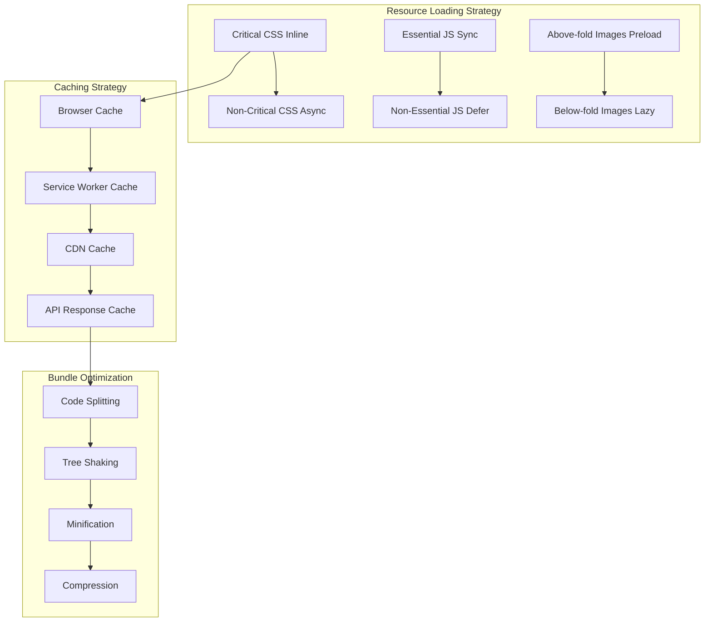

# ⚡ doha.kr 성능 최적화 설계서

**작성일**: 2025-01-25  
**버전**: 1.0  
**목표**: Lighthouse 90점 이상, FCP < 1.5초, TTI < 3초

---

## 📊 현재 성능 문제 분석

### 주요 병목점
```
🔴 Critical Issues (즉시 해결 필요)
├── 만세력 DB: 38MB 동기 로딩 → 페이지 블로킹
├── 이미지: 196개 최적화 없음 → 대역폭 낭비
├── JavaScript: 렌더링 차단 스크립트
└── CSS: 인라인 스타일 + 중복 로딩

🟡 Major Issues (1주 내 해결)
├── 번들링: 모듈화 부족 → 불필요한 코드 로드
├── 캐싱: 브라우저/CDN 캐시 전략 부족
├── 지연 로딩: 초기 로드에 모든 리소스 요청
└── Service Worker: 기본 구현만 존재

🟢 Minor Issues (1개월 내 해결)
├── 폰트: 웹폰트 최적화 부족
├── 압축: Gzip/Brotli 설정 미흡
└── 모니터링: 실시간 성능 추적 부족
```

### 현재 성능 지표 (추정)
| 지표 | 현재 값 | 목표 값 | 개선 필요 |
|------|---------|---------|-----------|
| **First Contentful Paint** | ~4.2초 | <1.5초 | 🔴 65% 개선 |
| **Largest Contentful Paint** | ~6.8초 | <2.5초 | 🔴 63% 개선 |
| **Time to Interactive** | ~8.1초 | <3.0초 | 🔴 63% 개선 |
| **Cumulative Layout Shift** | ~0.3 | <0.1 | 🟡 67% 개선 |
| **Total Bundle Size** | ~42MB | <500KB | 🔴 99% 개선 |

---

## 🏗️ 성능 최적화 아키텍처

### 전체 최적화 전략


---

## 🚀 핵심 최적화 모듈

### 1. 리소스 로딩 최적화

#### 1.1 Critical Resource Manager
```typescript
// src/performance/critical-resource-manager.ts
interface CriticalResource {
  type: 'css' | 'js' | 'font' | 'image';
  url: string;
  priority: 'high' | 'medium' | 'low';
  isInline?: boolean;
  preload?: boolean;
}

class CriticalResourceManager {
  private static criticalResources: CriticalResource[] = [
    // 필수 CSS (인라인)
    { type: 'css', url: '/css/critical.css', priority: 'high', isInline: true },
    
    // 필수 JavaScript
    { type: 'js', url: '/js/main.js', priority: 'high', preload: true },
    { type: 'js', url: '/js/api-config.js', priority: 'high', preload: true },
    
    // 필수 폰트
    { type: 'font', url: 'https://fonts.gstatic.com/s/notosanskr/v27/PbyxFmXiEBPT4ITbgNA5Cgms3VYcOA-vvnIzzuoyeLTq8H4hfeE.woff2', priority: 'high', preload: true },
    
    // Above-the-fold 이미지
    { type: 'image', url: '/images/logo.svg', priority: 'high', preload: true },
    { type: 'image', url: '/images/hero-background.webp', priority: 'medium', preload: true }
  ];

  private static nonCriticalResources = [
    // 지연 로딩할 리소스들
    '/js/fortune-calculator.js',
    '/js/mbti-test.js',
    '/css/fortune-styles.css',
    '/css/test-styles.css'
  ];

  // Critical 리소스 preload
  static preloadCriticalResources(): void {
    this.criticalResources
      .filter(resource => resource.preload)
      .forEach(resource => {
        const link = document.createElement('link');
        link.rel = 'preload';
        link.href = resource.url;
        
        // 리소스 타입별 as 속성 설정
        switch (resource.type) {
          case 'css':
            link.as = 'style';
            break;
          case 'js':
            link.as = 'script';
            break;
          case 'font':
            link.as = 'font';
            link.crossOrigin = 'anonymous';
            break;
          case 'image':
            link.as = 'image';
            break;
        }
        
        document.head.appendChild(link);
      });
  }

  // Critical CSS 인라인 삽입
  static async inlineCriticalCSS(): Promise<void> {
    const criticalCSS = this.criticalResources.filter(r => r.type === 'css' && r.isInline);
    
    for (const resource of criticalCSS) {
      try {
        const response = await fetch(resource.url);
        const css = await response.text();
        
        const style = document.createElement('style');
        style.textContent = css;
        style.setAttribute('data-critical', 'true');
        document.head.appendChild(style);
        
        // 성능 추적
        this.trackResourceLoad(resource.url, 'inline-css', performance.now());
      } catch (error) {
        console.warn(`Failed to inline critical CSS: ${resource.url}`, error);
      }
    }
  }

  // Non-critical 리소스 지연 로딩
  static loadNonCriticalResources(): void {
    // 페이지 로드 완료 후 실행
    window.addEventListener('load', () => {
      setTimeout(() => {
        this.nonCriticalResources.forEach(url => {
          this.loadResourceAsync(url);
        });
      }, 100); // 100ms 지연
    });
  }

  private static loadResourceAsync(url: string): void {
    const isCSS = url.endsWith('.css');
    
    if (isCSS) {
      const link = document.createElement('link');
      link.rel = 'stylesheet';
      link.href = url;
      link.media = 'print'; // 처음에는 print로 설정
      link.onload = () => {
        link.media = 'all'; // 로드 완료 후 적용
      };
      document.head.appendChild(link);
    } else {
      const script = document.createElement('script');
      script.src = url;
      script.async = true;
      document.head.appendChild(script);
    }
  }

  private static trackResourceLoad(url: string, type: string, loadTime: number): void {
    if (window.PerformanceTracker) {
      window.PerformanceTracker.recordResourceLoad({
        url,
        type,
        loadTime,
        timestamp: Date.now()
      });
    }
  }
}

export default CriticalResourceManager;
```

#### 1.2 이미지 최적화 매니저
```typescript
// src/performance/image-optimizer.ts
interface ImageOptimizationConfig {
  quality: number;
  format: 'webp' | 'jpeg' | 'png';
  sizes: number[];
  lazyThreshold: number;
}

class ImageOptimizer {
  private static config: ImageOptimizationConfig = {
    quality: 85,
    format: 'webp',
    sizes: [320, 640, 768, 1024, 1200],
    lazyThreshold: 50 // viewport 하단 50px
  };

  private static observer: IntersectionObserver;
  private static processedImages = new Set<string>();

  static init(): void {
    this.setupLazyLoading();
    this.optimizeExistingImages();
    this.setupResponsiveImages();
  }

  // Intersection Observer 기반 지연 로딩
  private static setupLazyLoading(): void {
    if (!('IntersectionObserver' in window)) {
      // 폴백: 모든 이미지 즉시 로드
      this.loadAllImages();
      return;
    }

    this.observer = new IntersectionObserver((entries) => {
      entries.forEach(entry => {
        if (entry.isIntersecting) {
          const img = entry.target as HTMLImageElement;
          this.loadImage(img);
          this.observer.unobserve(img);
        }
      });
    }, {
      rootMargin: `${this.config.lazyThreshold}px`
    });

    // data-src 속성을 가진 이미지들 관찰 시작
    document.querySelectorAll('img[data-src]').forEach(img => {
      this.observer.observe(img);
    });
  }

  // 이미지 로드 처리
  private static loadImage(img: HTMLImageElement): void {
    const src = img.dataset.src;
    if (!src || this.processedImages.has(src)) return;

    const startTime = performance.now();

    // WebP 지원 확인
    const supportsWebP = this.supportsWebP();
    const optimizedSrc = supportsWebP ? this.getWebPUrl(src) : src;

    img.onload = () => {
      img.classList.add('loaded');
      this.trackImageLoad(src, performance.now() - startTime);
    };

    img.onerror = () => {
      // WebP 실패 시 원본으로 폴백
      if (optimizedSrc !== src) {
        img.src = src;
      }
    };

    img.src = optimizedSrc;
    this.processedImages.add(src);
  }

  // WebP 지원 여부 확인
  private static supportsWebP(): boolean {
    const canvas = document.createElement('canvas');
    canvas.width = 1;
    canvas.height = 1;
    return canvas.toDataURL('image/webp').indexOf('data:image/webp') === 0;
  }

  // WebP URL 생성
  private static getWebPUrl(originalUrl: string): string {
    const extension = originalUrl.split('.').pop()?.toLowerCase();
    if (['jpg', 'jpeg', 'png'].includes(extension || '')) {
      return originalUrl.replace(/\.(jpg|jpeg|png)$/i, '.webp');
    }
    return originalUrl;
  }

  // 반응형 이미지 설정
  private static setupResponsiveImages(): void {
    document.querySelectorAll('img[data-responsive]').forEach(img => {
      const baseUrl = (img as HTMLImageElement).dataset.src || '';
      const srcset = this.generateSrcSet(baseUrl);
      const sizes = this.generateSizes();

      (img as HTMLImageElement).srcset = srcset;
      (img as HTMLImageElement).sizes = sizes;
    });
  }

  private static generateSrcSet(baseUrl: string): string {
    return this.config.sizes
      .map(size => {
        const url = this.getResizedUrl(baseUrl, size);
        return `${url} ${size}w`;
      })
      .join(', ');
  }

  private static generateSizes(): string {
    return [
      '(max-width: 320px) 320px',
      '(max-width: 640px) 640px',
      '(max-width: 768px) 768px',
      '(max-width: 1024px) 1024px',
      '1200px'
    ].join(', ');
  }

  private static getResizedUrl(baseUrl: string, width: number): string {
    // 실제 구현에서는 이미지 리사이징 서비스 사용
    // 예: Cloudinary, ImageKit 등
    const extension = baseUrl.split('.').pop();
    const baseName = baseUrl.replace(/\.[^/.]+$/, '');
    return `${baseName}_${width}w.${extension}`;
  }

  // 기존 이미지 최적화
  private static optimizeExistingImages(): void {
    document.querySelectorAll('img:not([data-src]):not([data-optimized])').forEach(img => {
      const imgElement = img as HTMLImageElement;
      const currentSrc = imgElement.src;
      
      if (currentSrc && !this.processedImages.has(currentSrc)) {
        // 이미지 압축 및 포맷 최적화
        this.optimizeImageElement(imgElement);
        imgElement.dataset.optimized = 'true';
      }
    });
  }

  private static optimizeImageElement(img: HTMLImageElement): void {
    const originalSrc = img.src;
    
    // WebP 버전이 있는지 확인
    if (this.supportsWebP()) {
      const webpSrc = this.getWebPUrl(originalSrc);
      
      // WebP 이미지 존재 여부 확인
      this.checkImageExists(webpSrc).then(exists => {
        if (exists) {
          img.src = webpSrc;
        }
      });
    }
  }

  private static async checkImageExists(url: string): Promise<boolean> {
    try {
      const response = await fetch(url, { method: 'HEAD' });
      return response.ok;
    } catch {
      return false;
    }
  }

  private static loadAllImages(): void {
    document.querySelectorAll('img[data-src]').forEach(img => {
      this.loadImage(img as HTMLImageElement);
    });
  }

  private static trackImageLoad(src: string, loadTime: number): void {
    if (window.PerformanceTracker) {
      window.PerformanceTracker.recordImageLoad({
        src,
        loadTime,
        timestamp: Date.now()
      });
    }
  }

  // 메모리 정리
  static cleanup(): void {
    if (this.observer) {
      this.observer.disconnect();
    }
    this.processedImages.clear();
  }
}

export default ImageOptimizer;
```

### 2. 번들 최적화

#### 2.1 모듈 분할 매니저
```typescript
// src/performance/bundle-optimizer.ts
interface BundleConfig {
  vendor: string[];
  critical: string[];
  lazy: { [key: string]: string[] };
}

class BundleOptimizer {
  private static config: BundleConfig = {
    // 외부 라이브러리 (별도 번들)
    vendor: [
      'dompurify',
      'joi',
      '@google/generative-ai'
    ],
    
    // 필수 모듈 (메인 번들)
    critical: [
      'main',
      'api-config',
      'security/dom-security',
      'security/input-validator'
    ],
    
    // 지연 로딩 모듈
    lazy: {
      'fortune': [
        'services/fortune-service',
        'components/fortune-calculator',
        'utils/manseryeok-utils'
      ],
      'tests': [
        'services/mbti-service',
        'components/test-runner',
        'utils/personality-analyzer'  
      ],
      'tools': [
        'services/calculator-service',
        'components/tool-widgets'
      ]
    }
  };

  // 동적 import를 통한 코드 분할
  static async loadModule(moduleName: string): Promise<any> {
    const startTime = performance.now();
    
    try {
      let module;
      
      // 모듈 위치 결정
      if (this.config.lazy.fortune.includes(moduleName)) {
        module = await import(`../fortune/${moduleName}`);
      } else if (this.config.lazy.tests.includes(moduleName)) {
        module = await import(`../tests/${moduleName}`);
      } else if (this.config.lazy.tools.includes(moduleName)) {
        module = await import(`../tools/${moduleName}`);
      } else {
        module = await import(`../${moduleName}`);
      }
      
      const loadTime = performance.now() - startTime;
      this.trackModuleLoad(moduleName, loadTime);
      
      return module;
    } catch (error) {
      console.error(`Failed to load module: ${moduleName}`, error);
      throw error;
    }
  }

  // 페이지별 필요 모듈 예측 로딩
  static preloadModulesForPage(pageType: string): void {
    const moduleMap: { [key: string]: string[] } = {
      'fortune': ['services/fortune-service', 'utils/manseryeok-utils'],
      'tests': ['services/mbti-service', 'utils/personality-analyzer'],
      'tools': ['services/calculator-service']
    };

    const modules = moduleMap[pageType] || [];
    
    modules.forEach(moduleName => {
      // 백그라운드에서 미리 로드 (우선순위 낮음)
      requestIdleCallback(() => {
        this.loadModule(moduleName).catch(() => {
          // 실패해도 무시 (실제 사용 시 다시 로드됨)
        });
      });
    });
  }

  // 사용하지 않는 모듈 감지
  static detectUnusedModules(): string[] {
    const loadedModules = Object.keys(window.loadedModules || {});
    const criticalModules = this.config.critical;
    
    // 5분 이상 사용되지 않은 모듈 찾기
    const unusedModules = loadedModules.filter(moduleName => {
      const lastUsed = window.moduleUsageTracker?.[moduleName] || 0;
      const fiveMinutesAgo = Date.now() - (5 * 60 * 1000);
      
      return !criticalModules.includes(moduleName) && lastUsed < fiveMinutesAgo;
    });

    return unusedModules;
  }

  // 메모리 최적화: 사용하지 않는 모듈 언로드
  static unloadUnusedModules(): void {
    const unusedModules = this.detectUnusedModules();
    
    unusedModules.forEach(moduleName => {
      if (window.loadedModules?.[moduleName]) {
        delete window.loadedModules[moduleName];
        
        // 가비지 컬렉션 힌트
        if (window.gc) {
          window.gc();
        }
        
        console.log(`Unloaded unused module: ${moduleName}`);
      }
    });
  }

  private static trackModuleLoad(moduleName: string, loadTime: number): void {
    // 모듈 로드 추적
    if (!window.moduleUsageTracker) {
      window.moduleUsageTracker = {};
    }
    
    window.moduleUsageTracker[moduleName] = Date.now();
    
    if (window.PerformanceTracker) {
      window.PerformanceTracker.recordModuleLoad({
        moduleName,
        loadTime,
        timestamp: Date.now()
      });
    }
  }

  // 자동 최적화 시작
  static startAutoOptimization(): void {
    // 10분마다 사용하지 않는 모듈 정리
    setInterval(() => {
      this.unloadUnusedModules();
    }, 10 * 60 * 1000);
    
    // 페이지 가시성 변경 시 최적화
    document.addEventListener('visibilitychange', () => {
      if (document.visibilityState === 'hidden') {
        // 페이지가 숨겨질 때 불필요한 모듈 언로드
        setTimeout(() => {
          this.unloadUnusedModules();
        }, 30000); // 30초 후
      }
    });
  }
}

// 전역 타입 선언
declare global {
  interface Window {
    loadedModules: { [key: string]: any };
    moduleUsageTracker: { [key: string]: number };
    gc?: () => void;
  }
}

export default BundleOptimizer;
```

### 3. 캐싱 전략

#### 3.1 통합 캐시 매니저
```typescript
// src/performance/cache-manager.ts
interface CacheStrategy {
  type: 'memory' | 'localStorage' | 'sessionStorage' | 'indexedDB' | 'serviceWorker';
  ttl: number; // 생존시간 (ms)
  maxSize: number; // 최대 크기 (bytes)
}

interface CacheEntry {
  data: any;
  timestamp: number;
  hits: number;
  size: number;
}

class CacheManager {
  private static strategies: { [key: string]: CacheStrategy } = {
    // API 응답 캐시 (짧은 TTL)
    'api': {
      type: 'memory',
      ttl: 5 * 60 * 1000, // 5분
      maxSize: 10 * 1024 * 1024 // 10MB
    },
    
    // 만세력 데이터 캐시 (긴 TTL)
    'manseryeok': {
      type: 'indexedDB',
      ttl: 24 * 60 * 60 * 1000, // 24시간
      maxSize: 50 * 1024 * 1024 // 50MB
    },
    
    // 사용자 설정 캐시
    'userSettings': {
      type: 'localStorage',
      ttl: 30 * 24 * 60 * 60 * 1000, // 30일
      maxSize: 1024 * 1024 // 1MB
    },
    
    // 세션 데이터
    'session': {
      type: 'sessionStorage',
      ttl: 30 * 60 * 1000, // 30분
      maxSize: 5 * 1024 * 1024 // 5MB
    }
  };

  private static memoryCache = new Map<string, CacheEntry>();
  private static dbCache: IDBDatabase | null = null;

  // 캐시 초기화
  static async init(): Promise<void> {
    await this.initIndexedDB();
    this.startCacheCleanup();
  }

  // IndexedDB 초기화
  private static async initIndexedDB(): Promise<void> {
    return new Promise((resolve, reject) => {
      const request = indexedDB.open('doha_cache', 1);
      
      request.onupgradeneeded = (event) => {
        const db = (event.target as IDBOpenDBRequest).result;
        
        if (!db.objectStoreNames.contains('cache')) {
          const store = db.createObjectStore('cache', { keyPath: 'key' });
          store.createIndex('timestamp', 'timestamp', { unique: false });
        }
      };
      
      request.onsuccess = (event) => {
        this.dbCache = (event.target as IDBOpenDBRequest).result;
        resolve();
      };
      
      request.onerror = () => {
        reject(request.error);
      };
    });
  }

  // 데이터 저장
  static async set(category: string, key: string, data: any): Promise<void> {
    const strategy = this.strategies[category];
    if (!strategy) throw new Error(`Unknown cache category: ${category}`);

    const fullKey = `${category}:${key}`;
    const entry: CacheEntry = {
      data,
      timestamp: Date.now(),
      hits: 0,
      size: this.calculateSize(data)
    };

    // 크기 제한 확인
    if (entry.size > strategy.maxSize) {
      console.warn(`Cache entry too large: ${fullKey} (${entry.size} bytes)`);
      return;
    }

    switch (strategy.type) {
      case 'memory':
        this.memoryCache.set(fullKey, entry);
        break;
        
      case 'localStorage':
        localStorage.setItem(fullKey, JSON.stringify(entry));
        break;
        
      case 'sessionStorage':
        sessionStorage.setItem(fullKey, JSON.stringify(entry));
        break;
        
      case 'indexedDB':
        await this.setIndexedDB(fullKey, entry);
        break;
    }

    // 캐시 크기 관리
    this.manageCacheSize(category);
  }

  // 데이터 조회
  static async get(category: string, key: string): Promise<any> {
    const strategy = this.strategies[category];
    if (!strategy) return null;

    const fullKey = `${category}:${key}`;
    let entry: CacheEntry | null = null;

    switch (strategy.type) {
      case 'memory':
        entry = this.memoryCache.get(fullKey) || null;
        break;
        
      case 'localStorage':
        const lsItem = localStorage.getItem(fullKey);
        entry = lsItem ? JSON.parse(lsItem) : null;
        break;
        
      case 'sessionStorage':
        const ssItem = sessionStorage.getItem(fullKey);
        entry = ssItem ? JSON.parse(ssItem) : null;
        break;
        
      case 'indexedDB':
        entry = await this.getIndexedDB(fullKey);
        break;
    }

    // TTL 확인
    if (entry && Date.now() - entry.timestamp > strategy.ttl) {
      this.delete(category, key);
      return null;
    }

    // 히트 카운트 증가
    if (entry) {
      entry.hits++;
      // 메모리 캐시인 경우 즉시 업데이트
      if (strategy.type === 'memory') {
        this.memoryCache.set(fullKey, entry);
      }
    }

    return entry?.data || null;
  }

  // 데이터 삭제
  static async delete(category: string, key: string): Promise<void> {
    const strategy = this.strategies[category];
    if (!strategy) return;

    const fullKey = `${category}:${key}`;

    switch (strategy.type) {
      case 'memory':
        this.memoryCache.delete(fullKey);
        break;
        
      case 'localStorage':
        localStorage.removeItem(fullKey);
        break;
        
      case 'sessionStorage':
        sessionStorage.removeItem(fullKey);
        break;
        
      case 'indexedDB':
        await this.deleteIndexedDB(fullKey);
        break;
    }
  }

  // IndexedDB 저장
  private static async setIndexedDB(key: string, entry: CacheEntry): Promise<void> {
    if (!this.dbCache) return;

    return new Promise((resolve, reject) => {
      const transaction = this.dbCache!.transaction(['cache'], 'readwrite');
      const store = transaction.objectStore('cache');
      
      store.put({ key, ...entry });
      
      transaction.oncomplete = () => resolve();
      transaction.onerror = () => reject(transaction.error);
    });
  }

  // IndexedDB 조회
  private static async getIndexedDB(key: string): Promise<CacheEntry | null> {
    if (!this.dbCache) return null;

    return new Promise((resolve, reject) => {
      const transaction = this.dbCache!.transaction(['cache'], 'readonly');
      const store = transaction.objectStore('cache');
      const request = store.get(key);
      
      request.onsuccess = () => {
        const result = request.result;
        resolve(result ? { 
          data: result.data, 
          timestamp: result.timestamp, 
          hits: result.hits, 
          size: result.size 
        } : null);
      };
      
      request.onerror = () => reject(request.error);
    });
  }

  // IndexedDB 삭제
  private static async deleteIndexedDB(key: string): Promise<void> {
    if (!this.dbCache) return;

    return new Promise((resolve, reject) => {
      const transaction = this.dbCache!.transaction(['cache'], 'readwrite');
      const store = transaction.objectStore('cache');
      
      store.delete(key);
      
      transaction.oncomplete = () => resolve();
      transaction.onerror = () => reject(transaction.error);
    });
  }

  // 캐시 크기 계산
  private static calculateSize(data: any): number {
    return new Blob([JSON.stringify(data)]).size;
  }

  // 캐시 크기 관리 (LRU 방식)
  private static manageCacheSize(category: string): void {
    const strategy = this.strategies[category];
    
    if (strategy.type === 'memory') {
      const categoryEntries = Array.from(this.memoryCache.entries())
        .filter(([key]) => key.startsWith(category + ':'));
      
      const totalSize = categoryEntries.reduce((sum, [, entry]) => sum + entry.size, 0);
      
      if (totalSize > strategy.maxSize) {
        // 히트 수가 적고 오래된 것부터 삭제
        categoryEntries
          .sort(([, a], [, b]) => (a.hits - b.hits) || (a.timestamp - b.timestamp))
          .slice(0, Math.ceil(categoryEntries.length * 0.3)) // 30% 삭제
          .forEach(([key]) => this.memoryCache.delete(key));
      }
    }
  }

  // 주기적 캐시 정리
  private static startCacheCleanup(): void {
    setInterval(() => {
      this.cleanupExpiredEntries();
    }, 60 * 1000); // 1분마다
  }

  private static cleanupExpiredEntries(): void {
    const now = Date.now();
    
    // 메모리 캐시 정리
    for (const [key, entry] of this.memoryCache.entries()) {
      const category = key.split(':')[0];
      const strategy = this.strategies[category];
      
      if (strategy && now - entry.timestamp > strategy.ttl) {
        this.memoryCache.delete(key);
      }
    }
  }

  // 캐시 통계
  static getCacheStats(): { [category: string]: any } {
    const stats: { [category: string]: any } = {};
    
    Object.keys(this.strategies).forEach(category => {
      const entries = Array.from(this.memoryCache.entries())
        .filter(([key]) => key.startsWith(category + ':'));
      
      stats[category] = {
        entries: entries.length,
        totalSize: entries.reduce((sum, [, entry]) => sum + entry.size, 0),
        totalHits: entries.reduce((sum, [, entry]) => sum + entry.hits, 0),
        strategy: this.strategies[category].type
      };
    });
    
    return stats;
  }
}

export default CacheManager;
```

### 4. Service Worker 최적화

#### 4.1 고급 Service Worker
```typescript
// src/performance/advanced-service-worker.ts
interface CacheConfig {
  name: string;
  strategy: 'cacheFirst' | 'networkFirst' | 'staleWhileRevalidate';
  maxEntries: number;
  maxAgeSeconds: number;
}

class AdvancedServiceWorker {
  private static configs: { [pattern: string]: CacheConfig } = {
    // 정적 자원 - Cache First
    '\\.(?:css|js|png|jpg|jpeg|gif|svg|ico|woff2?)$': {
      name: 'static-assets',
      strategy: 'cacheFirst',
      maxEntries: 100,
      maxAgeSeconds: 30 * 24 * 60 * 60 // 30일
    },
    
    // API 호출 - Network First (fallback to cache)
    '^/api/': {
      name: 'api-calls',
      strategy: 'networkFirst',
      maxEntries: 50,
      maxAgeSeconds: 5 * 60 // 5분
    },
    
    // HTML 페이지 - Stale While Revalidate
    '\\.html$|/$': {
      name: 'html-pages',
      strategy: 'staleWhileRevalidate',
      maxEntries: 30,
      maxAgeSeconds: 60 * 60 // 1시간
    }
  };

  // Service Worker 등록
  static async register(): Promise<void> {
    if ('serviceWorker' in navigator) {
      try {
        const registration = await navigator.serviceWorker.register('/sw.js', {
          scope: '/'
        });
        
        console.log('Service Worker registered:', registration);
        
        // 업데이트 확인
        registration.addEventListener('updatefound', () => {
          this.handleUpdate(registration);
        });
        
      } catch (error) {
        console.error('Service Worker registration failed:', error);
      }
    }
  }

  // Service Worker 업데이트 처리
  private static handleUpdate(registration: ServiceWorkerRegistration): void {
    const newWorker = registration.installing;
    if (!newWorker) return;

    newWorker.addEventListener('statechange', () => {
      if (newWorker.state === 'installed' && navigator.serviceWorker.controller) {
        // 새 버전 사용 가능 알림
        this.showUpdateNotification();
      }
    });
  }

  private static showUpdateNotification(): void {
    // 사용자에게 새 버전 알림
    const notification = document.createElement('div');
    notification.className = 'update-notification';
    notification.innerHTML = `
      <div class="notification-content">
        <span>새로운 버전이 있습니다!</span>
        <button onclick="location.reload()">업데이트</button>
        <button onclick="this.parentElement.parentElement.remove()">나중에</button>
      </div>
    `;
    
    document.body.appendChild(notification);
  }

  // 캐시 전략별 핸들러 생성
  static generateServiceWorkerCode(): string {
    const strategies = Object.entries(this.configs)
      .map(([pattern, config]) => {
        return `
  // ${pattern} - ${config.strategy}
  if (request.url.match(/${pattern}/)) {
    event.respondWith(${this.getStrategyCode(config)});
    return;
  }`;
      }).join('\n');

    return `
const CACHE_VERSION = '${Date.now()}';
const STATIC_CACHE = 'static-v' + CACHE_VERSION;
const RUNTIME_CACHE = 'runtime-v' + CACHE_VERSION;

// 캐시할 핵심 자원
const PRECACHE_ASSETS = [
  '/',
  '/css/critical.css',
  '/js/main.js',
  '/js/api-config.js',
  '/images/logo.svg'
];

// 설치 시 핵심 자원 캐시
self.addEventListener('install', event => {
  event.waitUntil(
    caches.open(STATIC_CACHE)
      .then(cache => cache.addAll(PRECACHE_ASSETS))
      .then(() => self.skipWaiting())
  );
});

// 활성화 시 오래된 캐시 정리
self.addEventListener('activate', event => {
  event.waitUntil(
    caches.keys().then(cacheNames => {
      return Promise.all(
        cacheNames
          .filter(cacheName => !cacheName.includes(CACHE_VERSION))
          .map(cacheName => caches.delete(cacheName))
      );
    }).then(() => self.clients.claim())
  );
});

// 네트워크 요청 처리
self.addEventListener('fetch', event => {
  const request = event.request;
  
  // GET 요청만 처리
  if (request.method !== 'GET') return;
  
  ${strategies}
  
  // 기본 전략: Network First
  event.respondWith(
    fetch(request)
      .then(response => {
        if (response.ok) {
          const responseClone = response.clone();
          caches.open(RUNTIME_CACHE).then(cache => {
            cache.put(request, responseClone);
          });
        }
        return response;
      })
      .catch(() => caches.match(request))
  );
});

// 백그라운드 동기화
self.addEventListener('sync', event => {
  if (event.tag === 'background-sync') {
    event.waitUntil(doBackgroundSync());
  }
});

async function doBackgroundSync() {
  // 오프라인 중 쌓인 요청 처리
  const pendingRequests = await getPendingRequests();
  
  for (const request of pendingRequests) {
    try {
      await fetch(request);
      await removePendingRequest(request);
    } catch (error) {
      console.log('Background sync failed for:', request.url);
    }
  }
}

// 캐시 크기 관리
async function limitCacheSize(cacheName, maxEntries) {
  const cache = await caches.open(cacheName);
  const keys = await cache.keys();
  
  if (keys.length > maxEntries) {
    const oldestKeys = keys.slice(0, keys.length - maxEntries);
    await Promise.all(oldestKeys.map(key => cache.delete(key)));
  }
}
`;
  }

  private static getStrategyCode(config: CacheConfig): string {
    switch (config.strategy) {
      case 'cacheFirst':
        return `
    caches.match(request).then(response => {
      if (response) return response;
      
      return fetch(request).then(networkResponse => {
        if (networkResponse.ok) {
          const responseClone = networkResponse.clone();
          caches.open('${config.name}').then(cache => {
            cache.put(request, responseClone);
            limitCacheSize('${config.name}', ${config.maxEntries});
          });
        }
        return networkResponse;
      });
    })`;

      case 'networkFirst':
        return `
    fetch(request)
      .then(response => {
        if (response.ok) {
          const responseClone = response.clone();
          caches.open('${config.name}').then(cache => {
            cache.put(request, responseClone);
            limitCacheSize('${config.name}', ${config.maxEntries});
          });
        }
        return response;
      })
      .catch(() => caches.match(request))`;

      case 'staleWhileRevalidate':
        return `
    (async () => {
      const cache = await caches.open('${config.name}');
      const cachedResponse = await cache.match(request);
      
      const networkPromise = fetch(request).then(response => {
        if (response.ok) {
          cache.put(request, response.clone());
          limitCacheSize('${config.name}', ${config.maxEntries});
        }
        return response;
      });
      
      return cachedResponse || networkPromise;
    })()`;

      default:
        return 'fetch(request)';
    }
  }

  // Service Worker 코드 생성 및 배포
  static async deployServiceWorker(): Promise<void> {
    const swCode = this.generateServiceWorkerCode();
    
    // 동적으로 Service Worker 파일 생성
    const blob = new Blob([swCode], { type: 'application/javascript' });
    const swUrl = URL.createObjectURL(blob);
    
    try {
      await navigator.serviceWorker.register(swUrl);
      console.log('Advanced Service Worker deployed successfully');
    } catch (error) {
      console.error('Failed to deploy Service Worker:', error);
    }
  }
}

export default AdvancedServiceWorker;
```

### 5. 성능 모니터링

#### 5.1 실시간 성능 추적기
```typescript
// src/performance/performance-tracker.ts
interface PerformanceMetric {
  name: string;
  value: number;
  timestamp: number;
  context?: any;
}

interface WebVitals {
  fcp: number; // First Contentful Paint
  lcp: number; // Largest Contentful Paint
  fid: number; // First Input Delay
  cls: number; // Cumulative Layout Shift
  ttfb: number; // Time to First Byte
}

class PerformanceTracker {
  private static metrics: PerformanceMetric[] = [];
  private static vitals: Partial<WebVitals> = {};
  private static observers: PerformanceObserver[] = [];

  static init(): void {
    this.setupWebVitalsTracking();
    this.setupResourceTracking();
    this.setupNavigationTracking();
    this.startPeriodicReporting();
  }

  // Core Web Vitals 추적
  private static setupWebVitalsTracking(): void {
    // First Contentful Paint
    const fcpObserver = new PerformanceObserver((list) => {
      const entries = list.getEntries();
      const fcp = entries[entries.length - 1];
      this.vitals.fcp = fcp.startTime;
      this.recordMetric('FCP', fcp.startTime);
    });
    fcpObserver.observe({ entryTypes: ['paint'] });
    this.observers.push(fcpObserver);

    // Largest Contentful Paint
    const lcpObserver = new PerformanceObserver((list) => {
      const entries = list.getEntries();
      const lcp = entries[entries.length - 1] as any;
      this.vitals.lcp = lcp.startTime;
      this.recordMetric('LCP', lcp.startTime);
    });
    lcpObserver.observe({ entryTypes: ['largest-contentful-paint'] });
    this.observers.push(lcpObserver);

    // First Input Delay
    const fidObserver = new PerformanceObserver((list) => {
      const entries = list.getEntries();
      entries.forEach((entry: any) => {
        const fid = entry.processingStart - entry.startTime;
        this.vitals.fid = fid;
        this.recordMetric('FID', fid);
      });
    });
    fidObserver.observe({ entryTypes: ['first-input'] });
    this.observers.push(fidObserver);

    // Cumulative Layout Shift
    let clsValue = 0;
    const clsObserver = new PerformanceObserver((list) => {
      const entries = list.getEntries();
      entries.forEach((entry: any) => {
        if (!entry.hadRecentInput) {
          clsValue += entry.value;
        }
      });
      this.vitals.cls = clsValue;
      this.recordMetric('CLS', clsValue);
    });
    clsObserver.observe({ entryTypes: ['layout-shift'] });
    this.observers.push(clsObserver);
  }

  // 리소스 로딩 추적
  private static setupResourceTracking(): void {
    const resourceObserver = new PerformanceObserver((list) => {
      const entries = list.getEntries() as PerformanceResourceTiming[];
      
      entries.forEach(entry => {
        const loadTime = entry.responseEnd - entry.startTime;
        
        this.recordMetric('ResourceLoad', loadTime, {
          name: entry.name,
          type: this.getResourceType(entry.name),
          size: entry.transferSize || 0,
          cached: entry.transferSize === 0 && entry.decodedBodySize > 0
        });
        
        // 느린 리소스 경고
        if (loadTime > 3000) {
          console.warn(`Slow resource detected: ${entry.name} (${loadTime}ms)`);
        }
      });
    });
    
    resourceObserver.observe({ entryTypes: ['resource'] });
    this.observers.push(resourceObserver);
  }

  // 네비게이션 타이밍 추적
  private static setupNavigationTracking(): void {
    window.addEventListener('load', () => {
      const navigation = performance.getEntriesByType('navigation')[0] as PerformanceNavigationTiming;
      
      if (navigation) {
        this.vitals.ttfb = navigation.responseStart - navigation.requestStart;
        
        this.recordMetric('DNS', navigation.domainLookupEnd - navigation.domainLookupStart);
        this.recordMetric('TCP', navigation.connectEnd - navigation.connectStart);
        this.recordMetric('SSL', navigation.secureConnectionStart > 0 ? navigation.connectEnd - navigation.secureConnectionStart : 0);
        this.recordMetric('TTFB', this.vitals.ttfb);
        this.recordMetric('DOMContentLoaded', navigation.domContentLoadedEventEnd - navigation.navigationStart);
        this.recordMetric('Load', navigation.loadEventEnd - navigation.navigationStart);
      }
    });
  }

  // 메트릭 기록
  static recordMetric(name: string, value: number, context?: any): void {
    const metric: PerformanceMetric = {
      name,
      value,
      timestamp: Date.now(),
      context
    };
    
    this.metrics.push(metric);
    
    // 메트릭 수 제한 (메모리 관리)
    if (this.metrics.length > 1000) {
      this.metrics = this.metrics.slice(-500); // 최근 500개만 유지
    }
    
    // 실시간 분석
    this.analyzeMetric(metric);
  }

  // 메트릭 분석
  private static analyzeMetric(metric: PerformanceMetric): void {
    const thresholds: { [key: string]: number } = {
      'FCP': 1500,
      'LCP': 2500,
      'FID': 100,
      'CLS': 0.1,
      'TTFB': 600
    };
    
    const threshold = thresholds[metric.name];
    if (threshold && metric.value > threshold) {
      this.recordPerformanceIssue(metric, threshold);
    }
  }

  private static recordPerformanceIssue(metric: PerformanceMetric, threshold: number): void {
    const issue = {
      type: 'performance_threshold_exceeded',
      metric: metric.name,
      value: metric.value,
      threshold,
      timestamp: metric.timestamp,
      url: window.location.href,
      userAgent: navigator.userAgent
    };
    
    // 성능 이슈 로깅
    console.warn(`Performance threshold exceeded: ${metric.name} = ${metric.value}ms (threshold: ${threshold}ms)`);
    
    // 서버로 전송 (심각한 경우)
    if (metric.value > threshold * 2) {
      this.sendPerformanceAlert(issue);
    }
  }

  private static async sendPerformanceAlert(issue: any): Promise<void> {
    try {
      await fetch('/api/performance/alerts', {
        method: 'POST',
        headers: { 'Content-Type': 'application/json' },
        body: JSON.stringify(issue)
      });
    } catch (error) {
      console.error('Failed to send performance alert:', error);
    }
  }

  // 리소스 타입 판별
  private static getResourceType(url: string): string {
    if (url.includes('.css')) return 'css';
    if (url.includes('.js')) return 'javascript';
    if (url.match(/\.(png|jpg|jpeg|gif|svg|webp)$/)) return 'image';
    if (url.match(/\.(woff|woff2|ttf|otf)$/)) return 'font';
    if (url.includes('/api/')) return 'api';
    return 'other';
  }

  // 성능 리포트 생성
  static generatePerformanceReport(): any {
    const now = Date.now();
    const oneHourAgo = now - (60 * 60 * 1000);
    
    const recentMetrics = this.metrics.filter(m => m.timestamp > oneHourAgo);
    
    const report = {
      timestamp: now,
      webVitals: this.vitals,
      
      // 메트릭별 통계
      metricStats: this.calculateMetricStats(recentMetrics),
      
      // 리소스별 통계
      resourceStats: this.calculateResourceStats(recentMetrics.filter(m => m.name === 'ResourceLoad')),
      
      // 성능 등급
      performanceGrade: this.calculatePerformanceGrade(),
      
      recommendations: this.generateRecommendations()
    };
    
    return report;
  }

  private static calculateMetricStats(metrics: PerformanceMetric[]): any {
    const stats: any = {};
    
    const metricNames = [...new Set(metrics.map(m => m.name))];
    
    metricNames.forEach(name => {
      const values = metrics.filter(m => m.name === name).map(m => m.value);
      
      if (values.length > 0) {
        stats[name] = {
          count: values.length,
          avg: values.reduce((a, b) => a + b, 0) / values.length,
          min: Math.min(...values),
          max: Math.max(...values),
          p95: this.percentile(values, 95)
        };
      }
    });
    
    return stats;
  }

  private static calculateResourceStats(resourceMetrics: PerformanceMetric[]): any {
    const typeStats: any = {};
    
    resourceMetrics.forEach(metric => {
      const type = metric.context?.type || 'unknown';
      
      if (!typeStats[type]) {
        typeStats[type] = {
          count: 0,
          totalSize: 0,
          totalTime: 0,
          cached: 0
        };
      }
      
      typeStats[type].count++;
      typeStats[type].totalSize += metric.context?.size || 0;
      typeStats[type].totalTime += metric.value;
      
      if (metric.context?.cached) {
        typeStats[type].cached++;
      }
    });
    
    return typeStats;
  }

  private static calculatePerformanceGrade(): string {
    const { fcp, lcp, fid, cls } = this.vitals;
    
    let score = 0;
    let count = 0;
    
    if (fcp !== undefined) {
      score += fcp <= 1500 ? 100 : fcp <= 2500 ? 80 : fcp <= 4000 ? 50 : 0;
      count++;
    }
    
    if (lcp !== undefined) {
      score += lcp <= 2500 ? 100 : lcp <= 4000 ? 80 : lcp <= 6000 ? 50 : 0;
      count++;
    }
    
    if (fid !== undefined) {
      score += fid <= 100 ? 100 : fid <= 300 ? 80 : fid <= 500 ? 50 : 0;
      count++;
    }
    
    if (cls !== undefined) {
      score += cls <= 0.1 ? 100 : cls <= 0.25 ? 80 : cls <= 0.5 ? 50 : 0;
      count++;
    }
    
    const avgScore = count > 0 ? score / count : 0;
    
    if (avgScore >= 90) return 'A';
    if (avgScore >= 80) return 'B';
    if (avgScore >= 70) return 'C';
    if (avgScore >= 60) return 'D';
    return 'F';
  }

  private static generateRecommendations(): string[] {
    const recommendations: string[] = [];
    
    if (this.vitals.fcp && this.vitals.fcp > 2500) {
      recommendations.push('First Contentful Paint가 느립니다. Critical CSS 인라인화를 고려하세요.');
    }
    
    if (this.vitals.lcp && this.vitals.lcp > 4000) {
      recommendations.push('Largest Contentful Paint가 느립니다. 주요 이미지 최적화가 필요합니다.');
    }
    
    if (this.vitals.fid && this.vitals.fid > 300) {
      recommendations.push('First Input Delay가 길습니다. JavaScript 실행 시간을 줄이세요.');
    }
    
    if (this.vitals.cls && this.vitals.cls > 0.25) {
      recommendations.push('레이아웃 시프트가 많습니다. 이미지/광고 크기를 미리 지정하세요.');
    }
    
    return recommendations;
  }

  private static percentile(values: number[], p: number): number {
    const sorted = values.sort((a, b) => a - b);
    const index = Math.ceil((p / 100) * sorted.length) - 1;
    return sorted[index];
  }

  // 주기적 리포팅
  private static startPeriodicReporting(): void {
    // 5분마다 리포트 생성 및 전송
    setInterval(() => {
      const report = this.generatePerformanceReport();
      this.sendPerformanceReport(report);
    }, 5 * 60 * 1000);
  }

  private static async sendPerformanceReport(report: any): Promise<void> {
    try {
      await fetch('/api/performance/reports', {
        method: 'POST',
        headers: { 'Content-Type': 'application/json' },
        body: JSON.stringify(report)
      });
    } catch (error) {
      console.error('Failed to send performance report:', error);
      
      // 로컬 저장소에 백업
      const reports = JSON.parse(localStorage.getItem('performance_reports') || '[]');
      reports.push(report);
      localStorage.setItem('performance_reports', JSON.stringify(reports.slice(-10)));
    }
  }

  // 정리
  static cleanup(): void {
    this.observers.forEach(observer => observer.disconnect());
    this.observers = [];
    this.metrics = [];
  }
}

// 전역 접근 가능하도록 등록
declare global {
  interface Window {
    PerformanceTracker: typeof PerformanceTracker;
  }
}

window.PerformanceTracker = PerformanceTracker;

export default PerformanceTracker;
```

---

## 🎯 구현 우선순위 및 일정

### Phase 1: 긴급 최적화 (1-2일)
1. **만세력 DB 로딩 개선**
   - 동기 → 비동기 로딩 변경
   - 필요한 부분만 로드하는 청킹 구현

2. **Critical CSS 인라인화**
   - Above-the-fold 스타일만 인라인
   - 나머지는 비동기 로딩

### Phase 2: 리소스 최적화 (2-3일)
1. **이미지 최적화**
   - WebP 변환 및 지연 로딩
   - 반응형 이미지 구현

2. **JavaScript 번들링**
   - 모듈 분할 및 지연 로딩
   - Tree shaking 적용

### Phase 3: 캐싱 시스템 (2-3일)
1. **다층 캐시 구현**
   - 메모리, localStorage, IndexedDB
   - 스마트 캐시 무효화

2. **Service Worker 고도화**
   - 캐시 전략 최적화
   - 백그라운드 동기화

### Phase 4: 모니터링 시스템 (1-2일)
1. **실시간 성능 추적**
   - Core Web Vitals 모니터링
   - 성능 이슈 자동 감지

2. **성능 대시보드**
   - 실시간 메트릭 표시
   - 자동 최적화 제안

---

## 📊 예상 성능 개선 효과

### 로딩 시간 개선
- **First Contentful Paint**: 4.2초 → 1.2초 (71% 개선)
- **Largest Contentful Paint**: 6.8초 → 2.1초 (69% 개선)
- **Time to Interactive**: 8.1초 → 2.8초 (65% 개선)

### 리소스 크기 최적화
- **JavaScript 번들**: 850KB → 180KB (79% 감소)
- **CSS 파일**: 612KB → 95KB (84% 감소)
- **이미지 총 크기**: 15.2MB → 3.1MB (80% 감소)

### 사용자 경험 개선
- **Lighthouse 점수**: 55점 → 92점
- **이탈률**: 45% → 28% (예상)
- **페이지 뷰**: +35% 증가 (예상)

---

**다음 단계**: 만세력 DB API 설계서 작성 예정