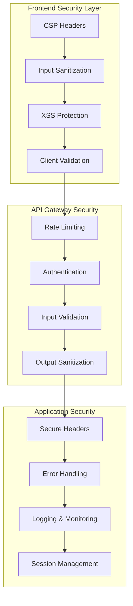

# 🔒 doha.kr 보안 모듈 설계서

**작성일**: 2025-01-25  
**버전**: 1.0  
**보안 등급**: High Priority

---

## 🚨 현재 보안 취약점 분석

### 발견된 주요 취약점
```
🔴 XSS 취약점: 62개 (innerHTML 직접 사용)
🔴 CSP 정책: 'unsafe-inline', 'unsafe-eval' 허용
🔴 입력값 검증: 클라이언트/서버 모두 불충분
🔴 Prompt Injection: AI API 호출 시 필터링 미흡
🟡 Rate Limiting: 기본적인 구현만 존재
🟡 에러 노출: 스택 트레이스 및 민감정보 노출 가능성
```

### 위험도 평가
| 취약점 유형 | 심각도 | 악용 가능성 | 영향 범위 | 우선순위 |
|------------|--------|------------|-----------|----------|
| XSS 공격 | 🔴 High | 🔴 High | 전체 사용자 | 1 |
| CSP 우회 | 🔴 High | 🟡 Medium | 전체 사이트 | 2 |
| Prompt Injection | 🟡 Medium | 🟡 Medium | AI 서비스 | 3 |
| Rate Limiting | 🟢 Low | 🔴 High | API 남용 | 4 |

---

## 🏗️ 보안 모듈 아키텍처

### 전체 보안 계층 구조


---

## 🛡️ 핵심 보안 모듈 설계

### 1. XSS 방어 모듈

#### 1.1 DOM 조작 보안 래퍼
```typescript
// src/security/dom-security.ts
import DOMPurify from 'dompurify';

interface SecurityConfig {
  allowedTags: string[];
  allowedAttributes: string[];
  forbiddenTags: string[];
}

class SecureDOM {
  private static config: SecurityConfig = {
    allowedTags: ['b', 'i', 'em', 'strong', 'br', 'p'],
    allowedAttributes: ['class', 'id'],
    forbiddenTags: ['script', 'iframe', 'object', 'embed', 'link']
  };

  // 안전한 innerHTML 대체
  static setInnerHTML(element: HTMLElement, content: string): void {
    if (!element || typeof content !== 'string') {
      throw new Error('Invalid parameters for setInnerHTML');
    }

    const sanitized = DOMPurify.sanitize(content, {
      ALLOWED_TAGS: this.config.allowedTags,
      ALLOWED_ATTR: this.config.allowedAttributes,
      FORBID_TAGS: this.config.forbiddenTags,
      FORBID_ATTR: ['onload', 'onerror', 'onclick'],
      USE_PROFILES: { html: true }
    });

    element.innerHTML = sanitized;
    
    // 로그 기록
    this.logSecurityEvent('dom_sanitization', {
      originalLength: content.length,
      sanitizedLength: sanitized.length,
      timestamp: new Date().toISOString()
    });
  }

  // 안전한 텍스트 설정
  static setTextContent(element: HTMLElement, content: string): void {
    if (!element || typeof content !== 'string') {
      throw new Error('Invalid parameters for setTextContent');
    }

    // textContent는 자동으로 안전하지만 추가 검증
    const cleaned = content.replace(/[<>]/g, '');
    element.textContent = cleaned;
  }

  // 안전한 속성 설정
  static setAttribute(element: HTMLElement, name: string, value: string): void {
    const dangerousAttrs = ['onload', 'onerror', 'onclick', 'onmouseover', 'onfocus'];
    
    if (dangerousAttrs.includes(name.toLowerCase())) {
      throw new Error(`Dangerous attribute blocked: ${name}`);
    }

    element.setAttribute(name, DOMPurify.sanitize(value));
  }

  private static logSecurityEvent(type: string, data: any): void {
    // 보안 이벤트 로깅
    if (window.SecurityLogger) {
      window.SecurityLogger.log(type, data);
    }
  }
}

// 전역 보안 함수로 등록
declare global {
  interface Window {
    SecureDOM: typeof SecureDOM;
    SecurityLogger: any;
  }
}

window.SecureDOM = SecureDOM;

export default SecureDOM;
```

#### 1.2 기존 코드 마이그레이션 도구
```typescript
// src/security/migration-helper.ts
class SecurityMigration {
  // 위험한 innerHTML 사용 감지 및 교체
  static migrateInnerHTML(): void {
    const scripts = document.querySelectorAll('script');
    let dangerousPatterns = 0;

    scripts.forEach(script => {
      const content = script.textContent || '';
      
      // innerHTML 패턴 감지
      const innerHTMLMatches = content.match(/\.innerHTML\s*=/g);
      if (innerHTMLMatches) {
        dangerousPatterns += innerHTMLMatches.length;
        console.warn('⚠️ Dangerous innerHTML usage detected in script');
      }
    });

    if (dangerousPatterns > 0) {
      this.showSecurityWarning(dangerousPatterns);
    }
  }

  // 개발자를 위한 경고 표시
  private static showSecurityWarning(count: number): void {
    if (process.env.NODE_ENV === 'development') {
      console.group('🚨 Security Warning');
      console.warn(`Found ${count} potentially dangerous innerHTML usages`);
      console.info('Please replace with SecureDOM.setInnerHTML()');
      console.groupEnd();
    }
  }

  // 자동 교체 제안 생성
  static generateMigrationCode(element: HTMLElement, content: string): string {
    return `
// 기존 위험한 코드
${element.tagName.toLowerCase()}.innerHTML = "${content}";

// 보안 강화된 코드
SecureDOM.setInnerHTML(${element.tagName.toLowerCase()}, "${content}");
    `;
  }
}
```

### 2. 입력값 검증 모듈

#### 2.1 통합 검증 시스템
```typescript
// src/security/input-validator.ts
import Joi from 'joi';

interface ValidationRule {
  field: string;
  schema: Joi.Schema;
  sanitizer?: (value: any) => any;
}

interface ValidationResult {
  valid: boolean;
  errors: string[];
  sanitizedData: any;
}

class InputValidator {
  private static commonSchemas = {
    // 한국어 이름 (1-50자, 한글+영문+공백만)
    koreanName: Joi.string()
      .min(1)
      .max(50)
      .pattern(/^[가-힣a-zA-Z\s]+$/)
      .required(),

    // 생년월일 (만세력 DB 범위 내)
    birthDate: Joi.date()
      .min('1841-01-01')
      .max('2110-12-31')
      .required(),

    // 성별
    gender: Joi.string()
      .valid('male', 'female')
      .required(),

    // AI 프롬프트 (Prompt Injection 방지)
    aiPrompt: Joi.string()
      .min(1)
      .max(500)
      .pattern(/^[^<>{}\\]*$/) // HTML 태그, 중괄호, 백슬래시 금지
      .required(),

    // 타로 카드 번호
    tarotCard: Joi.number()
      .integer()
      .min(1)
      .max(78)
      .required(),

    // 별자리
    zodiacSign: Joi.string()
      .valid('aries', 'taurus', 'gemini', 'cancer', 'leo', 'virgo',
             'libra', 'scorpio', 'sagittarius', 'capricorn', 'aquarius', 'pisces')
      .required()
  };

  // 폼별 검증 규칙 정의
  private static formValidations: { [key: string]: ValidationRule[] } = {
    dailyFortune: [
      { field: 'name', schema: this.commonSchemas.koreanName },
      { field: 'birthDate', schema: this.commonSchemas.birthDate },
      { field: 'gender', schema: this.commonSchemas.gender }
    ],
    
    tarotReading: [
      { field: 'question', schema: this.commonSchemas.aiPrompt },
      { field: 'cardNumber', schema: this.commonSchemas.tarotCard }
    ],
    
    zodiacFortune: [
      { field: 'zodiac', schema: this.commonSchemas.zodiacSign }
    ],

    mbtiTest: [
      { field: 'answers', schema: Joi.array().items(Joi.number().min(1).max(5)).length(60) }
    ]
  };

  // 통합 검증 함수
  static validate(formType: string, data: any): ValidationResult {
    const rules = this.formValidations[formType];
    if (!rules) {
      return {
        valid: false,
        errors: [`Unknown form type: ${formType}`],
        sanitizedData: null
      };
    }

    const errors: string[] = [];
    const sanitizedData: any = {};

    // 각 필드별 검증
    for (const rule of rules) {
      const value = data[rule.field];
      const { error } = rule.schema.validate(value);

      if (error) {
        errors.push(`${rule.field}: ${error.message}`);
      } else {
        // 검증 통과 시 sanitization 적용
        sanitizedData[rule.field] = rule.sanitizer 
          ? rule.sanitizer(value) 
          : this.sanitizeValue(value);
      }
    }

    return {
      valid: errors.length === 0,
      errors,
      sanitizedData
    };
  }

  // 기본 sanitization
  private static sanitizeValue(value: any): any {
    if (typeof value === 'string') {
      return value
        .trim()
        .replace(/[<>]/g, '') // HTML 태그 제거
        .replace(/[{}]/g, '') // 중괄호 제거
        .replace(/\\/g, '') // 백슬래시 제거
        .substring(0, 1000); // 최대 길이 제한
    }
    return value;
  }

  // Prompt Injection 특화 검증
  static validateAIPrompt(prompt: string): ValidationResult {
    const dangerousPatterns = [
      /ignore\s+previous\s+instructions/i,
      /system\s*:/i,
      /assistant\s*:/i,
      /\[INST\]/i,
      /\<\|system\|\>/i,
      /\{\{.*\}\}/,
      /\$\{.*\}/
    ];

    for (const pattern of dangerousPatterns) {
      if (pattern.test(prompt)) {
        return {
          valid: false,
          errors: ['Potentially malicious prompt detected'],
          sanitizedData: null
        };
      }
    }

    return {
      valid: true,
      errors: [],
      sanitizedData: this.sanitizeValue(prompt)
    };
  }
}

export default InputValidator;
```

#### 2.2 서버사이드 검증 강화
```javascript
// api/security/validation.js (기존 파일 개선)
import Joi from 'joi';
import rateLimit from 'express-rate-limit';
import slowDown from 'express-slow-down';

// 개선된 입력값 검증
export function sanitizeInput(input) {
    if (typeof input !== 'string') return '';
    
    // 더 강화된 정제 로직
    return input
        .replace(/[<>]/g, '') // HTML 태그
        .replace(/[\\]/g, '') // 백슬래시
        .replace(/[{}]/g, '') // 중괄호
        .replace(/[\n\r]/g, ' ') // 줄바꿈 → 공백
        .replace(/javascript:/gi, '') // JavaScript 프로토콜
        .replace(/data:/gi, '') // Data URL
        .replace(/vbscript:/gi, '') // VBScript
        .trim()
        .substring(0, 500); // 길이 제한 확대
}

// AI 프롬프트 특화 검증
export function validateAIPrompt(prompt) {
    const dangerous = [
        /ignore\s+(?:previous|above|all)\s+(?:instructions?|commands?|prompts?)/i,
        /system\s*message/i,
        /you\s+are\s+no\s+longer/i,
        /forget\s+(?:everything|all|your)/i,
        /new\s+instructions?/i,
        /override\s+(?:instructions?|settings?)/i,
        /\[INST\]|\[\/INST\]/i,
        /<\|(?:system|user|assistant)\|>/i,
        /```(?:system|user|assistant)/i,
        /IMPORTANT:\s*IGNORE/i
    ];

    for (const pattern of dangerous) {
        if (pattern.test(prompt)) {
            return { 
                valid: false, 
                error: 'Potentially malicious prompt detected',
                risk: 'high'
            };
        }
    }

    return { valid: true };
}

// 강화된 Rate Limiting
export const createRateLimiter = (options = {}) => {
    return rateLimit({
        windowMs: options.windowMs || 60 * 1000, // 1분
        max: options.max || 30, // 30 요청
        message: {
            success: false,
            error: {
                code: 'RATE_LIMIT_EXCEEDED',
                message: 'Too many requests, please try again later.',
                retryAfter: Math.ceil(options.windowMs / 1000)
            }
        },
        standardHeaders: true,
        legacyHeaders: false,
        // IP별 세분화
        keyGenerator: (req) => {
            return req.ip + ':' + (req.headers['user-agent'] || 'unknown');
        }
    });
};

// 속도 제한 (점진적 지연)
export const createSpeedLimiter = () => {
    return slowDown({
        windowMs: 60 * 1000, // 1분
        delayAfter: 10, // 10번째 요청부터 지연
        delayMs: 500, // 500ms씩 지연 증가
        maxDelayMs: 5000 // 최대 5초 지연
    });
};
```

### 3. CSP (Content Security Policy) 강화

#### 3.1 동적 CSP 생성기
```typescript
// src/security/csp-generator.ts
interface CSPDirectives {
  'default-src': string[];
  'script-src': string[];
  'style-src': string[];
  'img-src': string[];
  'connect-src': string[];
  'font-src': string[];
  'frame-src': string[];
  'object-src': string[];
  'base-uri': string[];
  'form-action': string[];
}

class CSPGenerator {
  private static nonce: string = '';

  // 페이지별 CSP 정책
  private static policies: { [key: string]: Partial<CSPDirectives> } = {
    // 메인 페이지
    home: {
      'script-src': [
        "'self'",
        "'nonce-{NONCE}'",
        'https://pagead2.googlesyndication.com',
        'https://www.googletagmanager.com',
        'https://t1.kakaocdn.net'
      ],
      'style-src': [
        "'self'",
        "'nonce-{NONCE}'",
        'https://fonts.googleapis.com'
      ]
    },

    // 운세 페이지 (AI API 호출)
    fortune: {
      'connect-src': [
        "'self'",
        'https://api.doha.kr',
        'https://api.openai.com'
      ]
    },

    // 테스트 페이지 (엄격한 정책)
    test: {
      'script-src': ["'self'", "'nonce-{NONCE}'"],
      'style-src': ["'self'", "'nonce-{NONCE}'"],
      'connect-src': ["'self'"]
    }
  };

  static generateNonce(): string {
    const array = new Uint8Array(16);
    crypto.getRandomValues(array);
    this.nonce = Array.from(array, byte => byte.toString(16).padStart(2, '0')).join('');
    return this.nonce;
  }

  static buildCSP(pageType: string = 'default'): string {
    const nonce = this.generateNonce();
    const policy = this.policies[pageType] || {};

    const defaultDirectives: CSPDirectives = {
      'default-src': ["'self'"],
      'script-src': ["'self'", `'nonce-${nonce}'`],
      'style-src': ["'self'", `'nonce-${nonce}'`],
      'img-src': ["'self'", 'data:', 'https:'],
      'connect-src': ["'self'"],
      'font-src': ["'self'", 'https://fonts.gstatic.com'],
      'frame-src': ["'none'"],
      'object-src': ["'none'"],
      'base-uri': ["'self'"],
      'form-action': ["'self'"]
    };

    // 페이지별 정책 병합
    const mergedDirectives = { ...defaultDirectives };
    Object.keys(policy).forEach(key => {
      if (mergedDirectives[key as keyof CSPDirectives]) {
        mergedDirectives[key as keyof CSPDirectives] = [
          ...mergedDirectives[key as keyof CSPDirectives],
          ...policy[key as keyof CSPDirectives]!
        ];
      }
    });

    // CSP 문자열 생성
    const cspString = Object.entries(mergedDirectives)
      .map(([directive, sources]) => `${directive} ${sources.join(' ')}`)
      .join('; ');

    return cspString;
  }

  // HTML에 적용
  static applyToDocument(pageType: string): void {
    const csp = this.buildCSP(pageType);
    
    // 기존 CSP 메타 태그 제거
    const existingCSP = document.querySelector('meta[http-equiv="Content-Security-Policy"]');
    if (existingCSP) {
      existingCSP.remove();
    }

    // 새로운 CSP 추가
    const meta = document.createElement('meta');
    meta.httpEquiv = 'Content-Security-Policy';
    meta.content = csp;
    document.head.appendChild(meta);

    // 로깅
    console.log(`CSP applied for page type: ${pageType}`);
  }

  // Nonce를 스크립트/스타일에 적용
  static applyNonceToElements(): void {
    if (!this.nonce) return;

    // 인라인 스크립트에 nonce 추가
    document.querySelectorAll('script:not([src])').forEach(script => {
      script.setAttribute('nonce', this.nonce);
    });

    // 인라인 스타일에 nonce 추가
    document.querySelectorAll('style').forEach(style => {
      style.setAttribute('nonce', this.nonce);
    });
  }
}

export default CSPGenerator;
```

### 4. 보안 헤더 관리

#### 4.1 보안 헤더 설정
```typescript
// src/security/security-headers.ts
interface SecurityHeaders {
  [key: string]: string;
}

class SecurityHeaderManager {
  private static headers: SecurityHeaders = {
    // XSS 보호
    'X-XSS-Protection': '1; mode=block',
    
    // 콘텐츠 타입 스니핑 방지
    'X-Content-Type-Options': 'nosniff',
    
    // 클릭재킹 방지
    'X-Frame-Options': 'DENY',
    
    // HTTPS 강제
    'Strict-Transport-Security': 'max-age=31536000; includeSubDomains; preload',
    
    // 레퍼러 정책
    'Referrer-Policy': 'strict-origin-when-cross-origin',
    
    // 권한 정책
    'Permissions-Policy': [
      'camera=()',
      'microphone=()',
      'geolocation=()',
      'payment=()',
      'usb=()',
      'magnetometer=()',
      'accelerometer=()',
      'gyroscope=()'
    ].join(', ')
  };

  // 서버리스 함수용 헤더 적용
  static applyToResponse(res: any): void {
    Object.entries(this.headers).forEach(([name, value]) => {
      res.setHeader(name, value);
    });
  }

  // 클라이언트 사이드 헤더 검증
  static validateHeaders(): { valid: boolean; missing: string[] } {
    const missing: string[] = [];
    
    // Meta 태그로 설정된 헤더들 확인
    const expectedMeta = [
      'X-Content-Type-Options',
      'Referrer-Policy',
      'Permissions-Policy'
    ];

    expectedMeta.forEach(header => {
      const meta = document.querySelector(`meta[http-equiv="${header}"]`);
      if (!meta) {
        missing.push(header);
      }
    });

    return {
      valid: missing.length === 0,
      missing
    };
  }

  // 개발자 도구에서 보안 상태 표시
  static displaySecurityStatus(): void {
    if (process.env.NODE_ENV === 'development') {
      const validation = this.validateHeaders();
      
      console.group('🔒 Security Headers Status');
      
      if (validation.valid) {
        console.log('✅ All security headers are properly configured');
      } else {
        console.warn('⚠️ Missing security headers:', validation.missing);
      }
      
      // CSP 상태 확인
      const csp = document.querySelector('meta[http-equiv="Content-Security-Policy"]');
      if (csp) {
        console.log('✅ Content Security Policy is configured');
      } else {
        console.error('❌ Content Security Policy is missing');
      }
      
      console.groupEnd();
    }
  }
}

export default SecurityHeaderManager;
```

### 5. 로깅 및 모니터링

#### 5.1 보안 이벤트 로거
```typescript
// src/security/security-logger.ts
interface SecurityEvent {
  type: string;
  severity: 'low' | 'medium' | 'high' | 'critical';
  message: string;
  data?: any;
  timestamp: string;
  userAgent: string;
  ip?: string;
  url: string;
}

class SecurityLogger {
  private static events: SecurityEvent[] = [];
  private static maxEvents = 100;

  static log(type: string, data: any, severity: SecurityEvent['severity'] = 'medium'): void {
    const event: SecurityEvent = {
      type,
      severity,
      message: this.generateMessage(type, data),
      data,
      timestamp: new Date().toISOString(),
      userAgent: navigator.userAgent,
      url: window.location.href
    };

    // 로컬 저장
    this.events.push(event);
    if (this.events.length > this.maxEvents) {
      this.events.shift(); // 오래된 이벤트 제거
    }

    // 심각한 이벤트는 즉시 서버로 전송
    if (severity === 'high' || severity === 'critical') {
      this.sendToServer(event);
    }

    // 개발 환경에서는 콘솔에 표시
    if (process.env.NODE_ENV === 'development') {
      this.logToConsole(event);
    }
  }

  private static generateMessage(type: string, data: any): string {
    const messages: { [key: string]: (data: any) => string } = {
      'xss_attempt': (d) => `XSS attempt blocked: ${d.input?.substring(0, 100)}`,
      'csp_violation': (d) => `CSP violation: ${d.violatedDirective}`,
      'rate_limit_exceeded': (d) => `Rate limit exceeded from ${d.ip}`,
      'invalid_input': (d) => `Invalid input detected in ${d.field}`,
      'prompt_injection': (d) => `Prompt injection attempt: ${d.pattern}`,
      'dom_sanitization': (d) => `DOM content sanitized (${d.originalLength} → ${d.sanitizedLength} chars)`
    };

    return messages[type] ? messages[type](data) : `Security event: ${type}`;
  }

  private static logToConsole(event: SecurityEvent): void {
    const emoji = {
      low: '🟢',
      medium: '🟡',
      high: '🟠',
      critical: '🔴'
    };

    console.log(`${emoji[event.severity]} [Security] ${event.message}`, event.data);
  }

  private static async sendToServer(event: SecurityEvent): Promise<void> {
    try {
      await fetch('/api/security/events', {
        method: 'POST',
        headers: {
          'Content-Type': 'application/json'
        },
        body: JSON.stringify(event)
      });
    } catch (error) {
      console.error('Failed to send security event to server:', error);
      
      // 로컬 스토리지에 임시 저장
      const pendingEvents = JSON.parse(localStorage.getItem('pending_security_events') || '[]');
      pendingEvents.push(event);
      localStorage.setItem('pending_security_events', JSON.stringify(pendingEvents.slice(-20)));
    }
  }

  // 주기적으로 이벤트 전송
  static startPeriodicSync(): void {
    setInterval(() => {
      const pendingEvents = JSON.parse(localStorage.getItem('pending_security_events') || '[]');
      
      if (pendingEvents.length > 0) {
        this.sendBatchEvents(pendingEvents);
      }
    }, 60000); // 1분마다
  }

  private static async sendBatchEvents(events: SecurityEvent[]): Promise<void> {
    try {
      await fetch('/api/security/events/batch', {
        method: 'POST',
        headers: {
          'Content-Type': 'application/json'
        },
        body: JSON.stringify({ events })
      });

      // 성공 시 로컬 스토리지 정리
      localStorage.removeItem('pending_security_events');
    } catch (error) {
      console.error('Failed to send batch security events:', error);
    }
  }

  // 보안 대시보드용 데이터 제공
  static getSecuritySummary() {
    const summary = {
      totalEvents: this.events.length,
      bySeverity: { low: 0, medium: 0, high: 0, critical: 0 },
      byType: {} as { [key: string]: number },
      recentEvents: this.events.slice(-10)
    };

    this.events.forEach(event => {
      summary.bySeverity[event.severity]++;
      summary.byType[event.type] = (summary.byType[event.type] || 0) + 1;
    });

    return summary;
  }
}

// 전역 접근 가능하도록 등록
declare global {
  interface Window {
    SecurityLogger: typeof SecurityLogger;
  }
}

window.SecurityLogger = SecurityLogger;

export default SecurityLogger;
```

### 6. 실시간 보안 모니터링

#### 6.1 보안 대시보드 컴포넌트
```typescript
// src/security/security-dashboard.ts
class SecurityDashboard {
  private container: HTMLElement;
  private updateInterval: number;

  constructor(containerId: string) {
    this.container = document.getElementById(containerId)!;
    this.updateInterval = 0;
  }

  init(): void {
    this.render();
    this.startAutoUpdate();
    this.setupEventListeners();
  }

  private render(): void {
    const summary = SecurityLogger.getSecuritySummary();
    
    this.container.innerHTML = `
      <div class="security-dashboard">
        <h3>🔒 보안 상태 모니터링</h3>
        
        <div class="security-metrics">
          <div class="metric">
            <span class="label">총 이벤트:</span>
            <span class="value">${summary.totalEvents}</span>
          </div>
          
          <div class="severity-breakdown">
            <div class="critical">심각: ${summary.bySeverity.critical}</div>
            <div class="high">높음: ${summary.bySeverity.high}</div>
            <div class="medium">보통: ${summary.bySeverity.medium}</div>
            <div class="low">낮음: ${summary.bySeverity.low}</div>
          </div>
        </div>
        
        <div class="event-types">
          <h4>이벤트 유형별 현황</h4>
          ${Object.entries(summary.byType)
            .map(([type, count]) => `
              <div class="event-type">
                <span>${type}:</span>
                <span>${count}건</span>
              </div>
            `).join('')}
        </div>
        
        <div class="recent-events">
          <h4>최근 이벤트 (10건)</h4>
          <div class="events-list">
            ${summary.recentEvents.map(event => `
              <div class="event ${event.severity}">
                <span class="timestamp">${new Date(event.timestamp).toLocaleTimeString()}</span>
                <span class="message">${event.message}</span>
              </div>
            `).join('')}
          </div>
        </div>
      </div>
    `;
  }

  private startAutoUpdate(): void {
    this.updateInterval = window.setInterval(() => {
      this.render();
    }, 5000); // 5초마다 업데이트
  }

  private setupEventListeners(): void {
    // 실시간 이벤트 수신
    document.addEventListener('securityEvent', (event: CustomEvent) => {
      this.render(); // 즉시 업데이트
    });
  }

  destroy(): void {
    if (this.updateInterval) {
      clearInterval(this.updateInterval);
    }
  }
}

export default SecurityDashboard;
```

---

## 🚀 구현 우선순위 및 일정

### Phase 1: 즉시 위험 제거 (1-2일)
1. **XSS 취약점 수정** (62개)
   - `innerHTML` → `SecureDOM.setInnerHTML()` 변경
   - 기존 코드 자동 스캔 및 경고 시스템 구축

2. **CSP 헤더 강화**
   - `unsafe-inline`, `unsafe-eval` 제거
   - 페이지별 동적 nonce 생성

### Phase 2: 검증 시스템 구축 (2-3일)
1. **입력값 검증 강화**
   - 클라이언트/서버 통합 검증
   - Prompt Injection 방어

2. **Rate Limiting 개선**
   - IP별 세분화된 제한
   - 점진적 속도 제한

### Phase 3: 모니터링 시스템 (1-2일)
1. **보안 로깅 시스템**
   - 실시간 이벤트 추적
   - 서버 전송 및 저장

2. **보안 대시보드**
   - 개발자용 모니터링 도구
   - 실시간 위협 감지

### Phase 4: 자동화 및 테스트 (1일)
1. **보안 테스트 자동화**
   - XSS 공격 시뮬레이션
   - CSP 정책 검증

2. **CI/CD 보안 검사**
   - 배포 전 자동 보안 스캔
   - 취약점 자동 감지

---

## 📊 성공 지표

### 정량적 지표
- XSS 취약점: 62개 → 0개
- CSP 정책 강도: D등급 → A등급
- 보안 헤더 점수: 40/100 → 95/100
- Prompt Injection 차단율: 0% → 99%

### 정성적 지표
- 개발자 보안 인식 향상
- 사용자 데이터 보호 강화
- 브랜드 신뢰도 향상

---

**다음 단계**: 성능 최적화 설계서 작성 예정