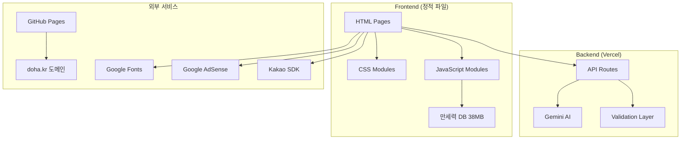
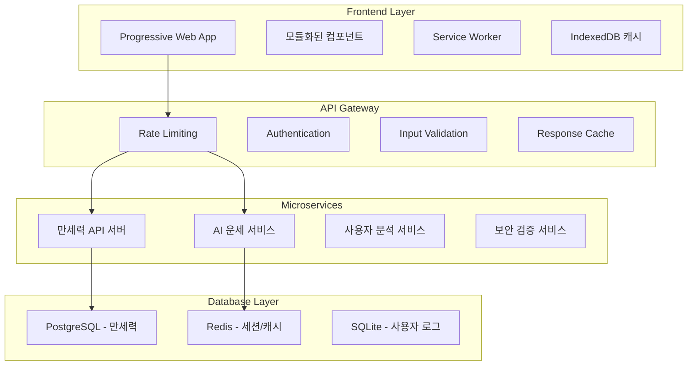

# 🏗️ doha.kr 기술 아키텍처 설계서

**작성일**: 2025-01-25  
**버전**: 1.0  
**담당**: Claude Code Assistant

---

## 1. 시스템 아키텍처 개요

### 1.1 현재 아키텍처


### 1.2 목표 아키텍처


---

## 2. 컴포넌트별 상세 설계

### 2.1 Frontend 모듈 시스템

#### 현재 문제점
- 62개의 XSS 취약점 (innerHTML 사용)
- 450개의 console.log 문
- 38MB 만세력 DB의 동기적 로딩
- 중복된 함수 (debounce, validateForm 등)

#### 개선 설계
```typescript
// 새로운 모듈 구조
interface ModuleSystem {
  core: {
    validator: SecurityValidator;
    cache: CacheManager;
    api: ApiClient;
    logger: Logger;
  };
  
  components: {
    forms: FormHandler[];
    calculators: Calculator[];
    fortune: FortuneReader[];
  };
  
  services: {
    manseryeok: ManseryeokService;
    ai: AIService;
    analytics: AnalyticsService;
  };
}

// 보안 검증 모듈
class SecurityValidator {
  sanitizeHTML(input: string): string {
    return DOMPurify.sanitize(input, {
      ALLOWED_TAGS: ['b', 'i', 'em', 'strong'],
      ALLOWED_ATTR: []
    });
  }
  
  validateInput(input: any, schema: ValidationSchema): ValidationResult {
    return joi.validate(input, schema);
  }
  
  checkCSP(): boolean {
    return document.querySelector('meta[http-equiv="Content-Security-Policy"]') !== null;
  }
}
```

### 2.2 API 계층 설계

#### 새로운 API 구조
```javascript
// api/routes/
├── fortune/
│   ├── daily.js      // 일일 운세
│   ├── saju.js       // 사주팔자
│   ├── tarot.js      // 타로 카드
│   └── zodiac.js     // 별자리/띠별
├── manseryeok/
│   ├── query.js      // 날짜 기반 조회
│   ├── batch.js      // 배치 조회
│   └── cache.js      // 캐시 관리
├── security/
│   ├── validate.js   // 입력값 검증
│   ├── sanitize.js   // 데이터 정제
│   └── ratelimit.js  // 속도 제한
└── analytics/
    ├── usage.js      // 사용량 추적
    └── performance.js // 성능 모니터링
```

#### API 설계 원칙
```javascript
// 통일된 응답 형식
interface APIResponse<T> {
  success: boolean;
  data?: T;
  error?: {
    code: string;
    message: string;
    details?: any;
  };
  meta?: {
    timestamp: string;
    requestId: string;
    cached: boolean;
  };
}

// 보안 헤더 적용
const securityHeaders = {
  'Content-Security-Policy': "default-src 'self'; script-src 'self' 'nonce-random';",
  'X-Content-Type-Options': 'nosniff',
  'X-Frame-Options': 'DENY',
  'X-XSS-Protection': '1; mode=block',
  'Strict-Transport-Security': 'max-age=31536000; includeSubDomains'
};
```

### 2.3 만세력 DB 최적화 설계

#### 현재 상황
- 크기: 38MB (1,676,489 라인)
- 로딩: 동기적, 전체 메모리 로드
- 검색: O(n) 선형 검색

#### 최적화 방안

##### Option 1: PostgreSQL 마이그레이션 (권장)
```sql
-- 테이블 설계
CREATE TABLE manseryeok_data (
    id SERIAL PRIMARY KEY,
    solar_year INTEGER NOT NULL,
    solar_month INTEGER NOT NULL,
    solar_day INTEGER NOT NULL,
    lunar_year INTEGER NOT NULL,
    lunar_month INTEGER NOT NULL,
    lunar_day INTEGER NOT NULL,
    leap_month BOOLEAN DEFAULT FALSE,
    gapja_year VARCHAR(10),
    gapja_month VARCHAR(10),
    gapja_day VARCHAR(10),
    season_info JSONB,
    created_at TIMESTAMP DEFAULT NOW()
);

-- 인덱스 생성
CREATE INDEX idx_solar_date ON manseryeok_data(solar_year, solar_month, solar_day);
CREATE INDEX idx_lunar_date ON manseryeok_data(lunar_year, lunar_month, lunar_day);
CREATE INDEX idx_gapja ON manseryeok_data(gapja_year, gapja_month, gapja_day);
```

##### Option 2: 청크 분할 + IndexedDB
```javascript
// 클라이언트측 캐싱
class ManseryeokCache {
  constructor() {
    this.dbName = 'manseryeok_cache';
    this.version = 1;
  }
  
  async openDB() {
    return new Promise((resolve, reject) => {
      const request = indexedDB.open(this.dbName, this.version);
      
      request.onupgradeneeded = (event) => {
        const db = event.target.result;
        
        if (!db.objectStoreNames.contains('data')) {
          const store = db.createObjectStore('data', { keyPath: 'dateKey' });
          store.createIndex('year', 'year', { unique: false });
          store.createIndex('month', 'month', { unique: false });
        }
      };
      
      request.onsuccess = () => resolve(request.result);
      request.onerror = () => reject(request.error);
    });
  }
  
  async getManseryeok(year, month, day) {
    const dateKey = `${year}-${month}-${day}`;
    
    // 1. IndexedDB에서 확인
    const cached = await this.getCached(dateKey);
    if (cached) return cached;
    
    // 2. API에서 조회
    const response = await fetch(`/api/manseryeok?date=${dateKey}`);
    const data = await response.json();
    
    // 3. 캐시에 저장
    await this.setCached(dateKey, data);
    
    return data;
  }
}
```

---

## 3. 보안 아키텍처

### 3.1 다층 보안 전략

```javascript
// 1단계: 클라이언트 검증
class ClientSideValidator {
  static validateForm(formData) {
    const schema = {
      name: Joi.string().min(1).max(50).pattern(/^[가-힣a-zA-Z\s]+$/),
      birthDate: Joi.date().min('1841-01-01').max('2110-12-31'),
      gender: Joi.string().valid('male', 'female')
    };
    
    return Joi.validate(formData, schema);
  }
  
  static sanitizeInput(input) {
    return DOMPurify.sanitize(input, {
      ALLOWED_TAGS: [],
      ALLOWED_ATTR: []
    });
  }
}

// 2단계: 서버 검증
class ServerSideValidator {
  static async validateRequest(req, res, next) {
    // Rate Limiting
    const rateLimitResult = await checkRateLimit(req.ip);
    if (!rateLimitResult.allowed) {
      return res.status(429).json({
        success: false,
        error: {
          code: 'RATE_LIMIT_EXCEEDED',
          message: 'Too many requests',
          retryAfter: rateLimitResult.retryAfter
        }
      });
    }
    
    // Input Validation
    const validationResult = validateFortuneRequest(req.body.type, req.body.data);
    if (!validationResult.valid) {
      return res.status(400).json({
        success: false,
        error: {
          code: 'VALIDATION_ERROR',
          message: 'Invalid input data',
          details: validationResult.errors
        }
      });
    }
    
    next();
  }
}
```

### 3.2 CSP 정책 강화

```html
<!-- 현재 CSP (취약) -->
<meta http-equiv="Content-Security-Policy" 
      content="default-src 'self' https:; script-src 'self' 'unsafe-inline' 'unsafe-eval';">

<!-- 개선된 CSP (보안 강화) -->
<meta http-equiv="Content-Security-Policy" 
      content="default-src 'self'; 
               script-src 'self' 'nonce-{random}' https://pagead2.googlesyndication.com;
               style-src 'self' 'nonce-{random}' https://fonts.googleapis.com;
               img-src 'self' data: https:;
               connect-src 'self' https://api.doha.kr;
               font-src 'self' https://fonts.gstatic.com;
               frame-src 'none';
               object-src 'none';
               base-uri 'self';
               form-action 'self';">
```

---

## 4. 성능 최적화 아키텍처

### 4.1 로딩 최적화 전략

```javascript
// 리소스 힌트 시스템
class ResourceHints {
  static preloadCritical() {
    const criticalResources = [
      '/css/styles-cleaned.css',
      '/js/main.js',
      '/js/api-config.js'
    ];
    
    criticalResources.forEach(resource => {
      const link = document.createElement('link');
      link.rel = 'preload';
      link.href = resource;
      link.as = resource.endsWith('.css') ? 'style' : 'script';
      document.head.appendChild(link);
    });
  }
  
  static prefetchNonCritical() {
    const nonCriticalResources = [
      '/js/fortune-calculator.js',
      '/js/mbti-test.js',
      '/css/fortune-styles.css'
    ];
    
    nonCriticalResources.forEach(resource => {
      const link = document.createElement('link');
      link.rel = 'prefetch';
      link.href = resource;
      document.head.appendChild(link);
    });
  }
}

// 이미지 지연 로딩
class LazyLoader {
  constructor() {
    this.imageObserver = new IntersectionObserver(this.handleIntersection.bind(this), {
      rootMargin: '50px'
    });
  }
  
  observe() {
    document.querySelectorAll('img[data-src]').forEach(img => {
      this.imageObserver.observe(img);
    });
  }
  
  handleIntersection(entries) {
    entries.forEach(entry => {
      if (entry.isIntersecting) {
        const img = entry.target;
        img.src = img.dataset.src;
        img.removeAttribute('data-src');
        this.imageObserver.unobserve(img);
      }
    });
  }
}
```

### 4.2 Service Worker 개선

```javascript
// sw.js - 개선된 Service Worker
const CACHE_NAME = 'doha-kr-v2.0';
const STATIC_CACHE = 'static-v2.0';
const DYNAMIC_CACHE = 'dynamic-v2.0';

const STATIC_ASSETS = [
  '/',
  '/css/styles-cleaned.css',
  '/css/mobile-fixes.css',
  '/js/main.js',
  '/js/api-config.js',
  '/images/logo.svg'
];

// 설치 시 정적 자원 캐시
self.addEventListener('install', event => {
  event.waitUntil(
    Promise.all([
      caches.open(STATIC_CACHE).then(cache => cache.addAll(STATIC_ASSETS)),
      self.skipWaiting()
    ])
  );
});

// 네트워크 요청 전략
self.addEventListener('fetch', event => {
  const { request } = event;
  
  // API 요청: Network First
  if (request.url.includes('/api/')) {
    event.respondWith(
      fetch(request)
        .then(response => {
          const responseClone = response.clone();
          caches.open(DYNAMIC_CACHE).then(cache => {
            cache.put(request, responseClone);
          });
          return response;
        })
        .catch(() => caches.match(request))
    );
    return;
  }
  
  // 정적 자원: Cache First
  if (request.destination === 'image' || request.destination === 'style' || request.destination === 'script') {
    event.respondWith(
      caches.match(request)
        .then(response => response || fetch(request))
    );
    return;
  }
  
  // HTML: Stale While Revalidate
  event.respondWith(
    caches.match(request)
      .then(response => {
        const fetchPromise = fetch(request).then(networkResponse => {
          caches.open(DYNAMIC_CACHE).then(cache => {
            cache.put(request, networkResponse.clone());
          });
          return networkResponse;
        });
        
        return response || fetchPromise;
      })
  );
});
```

---

## 5. 모니터링 및 분석 시스템

### 5.1 성능 모니터링

```javascript
// 실시간 성능 추적
class PerformanceMonitor {
  constructor() {
    this.metrics = {
      pageLoad: 0,
      apiCalls: [],
      errors: [],
      userActions: []
    };
  }
  
  trackPageLoad() {
    window.addEventListener('load', () => {
      if (window.performance && window.performance.timing) {
        const timing = window.performance.timing;
        this.metrics.pageLoad = timing.loadEventEnd - timing.navigationStart;
        
        // Core Web Vitals
        this.trackWebVitals();
        
        // 서버로 전송
        this.sendMetrics();
      }
    });
  }
  
  trackWebVitals() {
    // Largest Contentful Paint
    new PerformanceObserver((list) => {
      const entries = list.getEntries();
      const lastEntry = entries[entries.length - 1];
      this.metrics.lcp = lastEntry.startTime;
    }).observe({ entryTypes: ['largest-contentful-paint'] });
    
    // First Input Delay
    new PerformanceObserver((list) => {
      const entries = list.getEntries();
      entries.forEach(entry => {
        this.metrics.fid = entry.processingStart - entry.startTime;
      });
    }).observe({ entryTypes: ['first-input'] });
    
    // Cumulative Layout Shift
    let clsValue = 0;
    new PerformanceObserver((list) => {
      for (const entry of list.getEntries()) {
        if (!entry.hadRecentInput) {
          clsValue += entry.value;
        }
      }
      this.metrics.cls = clsValue;
    }).observe({ entryTypes: ['layout-shift'] });
  }
  
  async sendMetrics() {
    try {
      await fetch('/api/analytics', {
        method: 'POST',
        headers: { 'Content-Type': 'application/json' },
        body: JSON.stringify({
          type: 'performance',
          data: this.metrics,
          timestamp: new Date().toISOString(),
          userAgent: navigator.userAgent,
          url: window.location.href
        })
      });
    } catch (error) {
      console.warn('Failed to send performance metrics:', error);
    }
  }
}
```

### 5.2 에러 추적 시스템

```javascript
// 전역 에러 처리
class ErrorTracker {
  constructor() {
    this.setupGlobalHandlers();
  }
  
  setupGlobalHandlers() {
    // JavaScript 에러
    window.addEventListener('error', (event) => {
      this.logError({
        type: 'javascript',
        message: event.message,
        filename: event.filename,
        lineno: event.lineno,
        colno: event.colno,
        stack: event.error?.stack
      });
    });
    
    // Promise rejection
    window.addEventListener('unhandledrejection', (event) => {
      this.logError({
        type: 'promise',
        message: event.reason?.message || 'Promise rejected',
        stack: event.reason?.stack
      });
    });
    
    // 리소스 로딩 에러
    window.addEventListener('error', (event) => {
      if (event.target !== window) {
        this.logError({
          type: 'resource',
          message: `Failed to load ${event.target.tagName}: ${event.target.src || event.target.href}`,
          element: event.target.outerHTML
        });
      }
    }, true);
  }
  
  async logError(errorInfo) {
    try {
      await fetch('/api/errors', {
        method: 'POST',
        headers: { 'Content-Type': 'application/json' },
        body: JSON.stringify({
          ...errorInfo,
          timestamp: new Date().toISOString(),
          url: window.location.href,
          userAgent: navigator.userAgent
        })
      });
    } catch (err) {
      // 로컬 스토리지에 임시 저장
      const errors = JSON.parse(localStorage.getItem('pending_errors') || '[]');
      errors.push(errorInfo);
      localStorage.setItem('pending_errors', JSON.stringify(errors.slice(-10)));
    }
  }
}
```

---

## 6. 배포 및 CI/CD 아키텍처

### 6.1 자동화된 빌드 시스템

```yaml
# .github/workflows/deploy.yml
name: Deploy to GitHub Pages

on:
  push:
    branches: [ main ]
  pull_request:
    branches: [ main ]

jobs:
  build-and-deploy:
    runs-on: ubuntu-latest
    
    steps:
    - name: Checkout
      uses: actions/checkout@v3
      
    - name: Setup Node.js
      uses: actions/setup-node@v3
      with:
        node-version: '18'
        cache: 'npm'
        
    - name: Install dependencies
      run: npm ci
      
    - name: Run security audit
      run: npm audit --audit-level high
      
    - name: Run tests
      run: npm test
      
    - name: Build production
      run: npm run build
      env:
        NODE_ENV: production
        
    - name: Run Lighthouse CI
      run: |
        npm install -g @lhci/cli
        lhci autorun
        
    - name: Deploy to GitHub Pages
      uses: peaceiris/actions-gh-pages@v3
      if: github.ref == 'refs/heads/main'
      with:
        github_token: ${{ secrets.GITHUB_TOKEN }}
        publish_dir: ./dist
```

### 6.2 품질 게이트

```javascript
// scripts/quality-gate.js
const lighthouse = require('lighthouse');
const chromeLauncher = require('chrome-launcher');

async function runQualityGate() {
  const chrome = await chromeLauncher.launch({ chromeFlags: ['--headless'] });
  
  const options = {
    logLevel: 'info',
    output: 'json',
    onlyCategories: ['performance', 'accessibility', 'best-practices', 'seo'],
    port: chrome.port,
  };
  
  const runnerResult = await lighthouse('https://doha.kr', options);
  const scores = runnerResult.lhr.categories;
  
  const thresholds = {
    performance: 90,
    accessibility: 95,
    'best-practices': 90,
    seo: 95
  };
  
  let failed = false;
  for (const [category, threshold] of Object.entries(thresholds)) {
    const score = scores[category].score * 100;
    console.log(`${category}: ${score} (threshold: ${threshold})`);
    
    if (score < threshold) {
      console.error(`❌ ${category} score ${score} is below threshold ${threshold}`);
      failed = true;
    } else {
      console.log(`✅ ${category} score ${score} meets threshold ${threshold}`);
    }
  }
  
  await chrome.kill();
  
  if (failed) {
    process.exit(1);
  }
  
  console.log('🎉 All quality gates passed!');
}

runQualityGate().catch(console.error);
```

---

## 7. 마이그레이션 계획

### 7.1 단계별 마이그레이션

#### Phase 1: 기반 구축 (1주)
1. **개발 환경 설정**
   ```bash
   # 패키지 설치
   npm init -y
   npm install --save-dev webpack webpack-cli typescript @types/node
   npm install --save dompurify joi rate-limiter-flexible
   ```

2. **보안 모듈 구현**
   - DOMPurify 통합
   - CSP 헤더 강화
   - 입력값 검증 모듈

3. **빌드 시스템 구축**
   - Webpack 설정
   - TypeScript 설정
   - 린팅 및 포맷팅

#### Phase 2: 병렬 개발 (2-3주)
1. **Track A: 보안 강화** (독립 작업)
   - XSS 방어 구현
   - CSP 정책 적용
   - 입력값 검증 강화

2. **Track B: 성능 최적화** (독립 작업)
   - 이미지 최적화
   - 번들링 최적화
   - Service Worker 개선

3. **Track C: 만세력 DB 최적화** (독립 작업)
   - PostgreSQL 마이그레이션
   - API 서버 구축
   - 캐싱 시스템 구현

#### Phase 3: 통합 및 테스트 (1주)
1. 모든 모듈 통합
2. 종단간 테스트
3. 성능 벤치마크
4. 보안 감사

#### Phase 4: 배포 및 모니터링 (1주)
1. 단계적 배포
2. 모니터링 시스템 활성화
3. 사용자 피드백 수집
4. 최종 최적화

---

## 8. 성공 지표 및 KPI

### 8.1 기술적 지표
- **보안**: OWASP Top 10 준수, XSS 취약점 0개
- **성능**: Lighthouse 90점 이상, FCP < 1.5초, TTI < 3초
- **안정성**: 에러율 < 0.1%, 가용성 99.9%
- **품질**: ESLint 에러 0개, 테스트 커버리지 > 80%

### 8.2 비즈니스 지표
- **사용자 경험**: 이탈률 < 30%, 페이지 체류시간 > 2분
- **SEO**: Core Web Vitals 모든 지표 Good 등급
- **운영 효율성**: 배포 시간 < 5분, 롤백 시간 < 2분

---

**다음 단계**: 개발 환경 구축 가이드 작성 예정